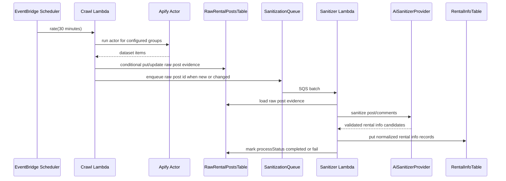

# feat: Add timtro-crawler service

## Summary

Add a new `apps/timtro-crawler` service that runs as AWS SAM-managed TypeScript Lambdas: a scheduled crawler pulls Facebook rental data through Apify, stores raw post evidence in DynamoDB, and queues sanitization work for a Gemini-backed AI provider abstraction that writes normalized rental info records.

---

## Problem Frame

The current repo exposes rental search from a local cache JSON, but the ingestion pipeline that produces durable, normalized rental data is not represented in the codebase. The new crawler service should become the first production-shaped ingestion path while keeping raw Apify data replayable before AI sanitization changes it.

---

## Requirements

- R1. Create a new service named `timtro-crawler` under `apps/`.
- R2. Deploy the service with AWS SAM using TypeScript on Node.js 24.
- R3. Run a scheduled crawl approximately every 30 minutes.
- R4. Use the provided Apify Facebook group actor to crawl accommodation and rental content from Facebook groups.
- R5. Store raw crawled Facebook post data in DynamoDB before sanitization.
- R6. Use one primary SQS queue to decouple raw ingestion from AI sanitization, with a DLQ for poison-message isolation.
- R7. Sanitize raw rental content with Gemini as the initial AI provider.
- R8. Keep the AI layer abstract so later providers can be added without changing crawler, queue, or persistence core logic.
- R9. Store normalized rental info in DynamoDB using `region` as the partition key and `id` as the sort key.
- R10. Support local debugging with SAM local.
- R11. Use Vite and Vitest for build-oriented tooling and unit tests.
- R12. Add GitHub CI/CD support for build, test, SAM validation/build, and deployment.

---

## Scope Boundaries

- The plan does not implement a UI, API endpoint, or MCP tool for reading the new DynamoDB rental info table.
- The plan does not migrate the existing `timtro-mcp` local-cache search path to DynamoDB.
- The plan does not add a second AI provider in v1; it only creates the abstraction and Gemini adapter.
- The plan does not solve cross-group duplicate listing detection beyond source-level idempotency.
- The plan does not require permanent media mirroring to S3 in v1; it records attachment URLs and leaves S3 archival as follow-up if DynamoDB item size, retention, or URL expiry becomes a blocker.

### Deferred to Follow-Up Work

- DynamoDB-backed `timtro-mcp` search integration: separate plan after the crawler produces stable sanitized records.
- Cross-post duplicate clustering: separate normalization layer after enough source data exists to evaluate matching quality.
- Raw payload S3 archival: add if real Apify payloads exceed DynamoDB item-size limits or if full raw evidence retention becomes mandatory.

---

## Context & Research

### Relevant Code and Patterns

- `pnpm-workspace.yaml` already includes `apps/*`, so `apps/timtro-crawler` fits the existing workspace structure.
- `apps/timtro-mcp/project.json` shows the local Nx pattern of app-level `project.json` targets backed by `nx:run-commands`.
- `apps/timtro-mcp/package.json` and root `package.json` use ESM packages, matching the repo-wide TypeScript configuration.
- `tsconfig.base.json` uses `module: NodeNext`, strict checking, declaration output, and no unused locals/parameters; the crawler should follow this style and use `.js` import specifiers in TypeScript.
- `docs/assets/sample-data/facebook_group_apify_response.json` shows Apify output fields the crawler must understand, including `facebookId`, `legacyId`, `url`, `time`, nested `attachments`, and `topComments` with `commentUrl` and `commentId`.
- No existing SAM, DynamoDB, SQS, Lambda, Vite, Vitest, or CI conventions exist in the repo, so the plan introduces them explicitly for this app.

### Institutional Learnings

- No `docs/solutions/` learning corpus exists yet for this repo. This work should be a candidate for a follow-up learning capture after implementation, especially around Nx + SAM + Apify + Gemini integration.

### External References

- AWS Lambda Node.js 24 runtime: https://docs.aws.amazon.com/lambda/latest/dg/lambda-nodejs.html
- AWS Lambda Node.js 24 announcement: https://aws.amazon.com/blogs/compute/node-js-24-runtime-now-available-in-aws-lambda/
- AWS SAM TypeScript/esbuild builds: https://docs.aws.amazon.com/serverless-application-model/latest/developerguide/serverless-sam-cli-using-build-typescript.html
- AWS SAM `ScheduleV2`: https://docs.aws.amazon.com/serverless-application-model/latest/developerguide/sam-property-function-schedulev2.html
- Lambda with SQS and partial batch failures: https://docs.aws.amazon.com/lambda/latest/dg/with-sqs.html
- SAM local invoke: https://docs.aws.amazon.com/serverless-application-model/latest/developerguide/using-sam-cli-local-invoke.html
- Apify JavaScript client: https://docs.apify.com/api/client/js/
- Gemini Node quickstart: https://ai.google.dev/gemini-api/docs/quickstart?lang=node
- Gemini structured output: https://ai.google.dev/gemini-api/docs/structured-output
- GitHub Actions OIDC for AWS: https://docs.github.com/actions/how-tos/secure-your-work/security-harden-deployments/oidc-in-aws

---

## Key Technical Decisions

- Create `apps/timtro-crawler` as a sibling Nx app: this preserves the existing monorepo shape while isolating crawler dependencies and deployment configuration from the MCP server.
- Use two DynamoDB tables: one raw rental posts table for replayable Apify evidence, and one rental info table for normalized records keyed by `region` and `id`.
- Keep the raw table keyed at the Facebook post level using the requested `id = <sourceType>_<groupId>_<postId>` shape: comments remain part of the raw post evidence, while the sanitizer may emit multiple rental info records from a post and its comments.
- Use source-level idempotency: crawler writes should be conditional on the raw post id plus content hash, and sanitizer writes should be deterministic by normalized rental info id.
- Preserve the requested `processStatus` values of `pending | completed | fail`: use SQS retry state, attempt metadata, timestamps, and `processError` to distinguish transient retry behavior without widening the public status enum.
- Treat successful non-rental classification as `processStatus = completed` with `sanitizedCount = 0` and a non-error process outcome, because the raw post was processed successfully even though it produced no rental info.
- Treat missing or ambiguous `city`/`district` as a validation failure for normal rental info writes: do not write malformed `region` keys, set `processStatus = fail`, and store a redacted `processError` category that can be replayed after validation rules improve.
- Use EventBridge Scheduler via SAM `ScheduleV2` with `rate(30 minutes)`: this matches the requested CRON-like interval and keeps the scheduled trigger in infrastructure code.
- Use SQS standard queue with DLQ and partial batch failure reporting: the sanitizer should be safe under at-least-once delivery and avoid retrying successful records in a partially failed batch.
- Hide Gemini behind an AI provider interface: core sanitizer orchestration depends on a provider contract, while Gemini-specific model names, prompt versions, JSON parsing, credentials, and retry/error mapping live in the adapter.
- Validate AI output after generation: Gemini structured output is useful but not sufficient; sanitized records should pass local schema validation before writing to DynamoDB.
- Use AWS Secrets Manager for `APIFY_TOKEN` and `GEMINI_API_KEY`: Lambdas receive secret ARNs in env vars and fetch values at runtime; local-only env overrides may exist but must never be committed.
- Use SAM esbuild for deployable Lambda bundles and Vite/Vitest for app build checks and unit tests: the CI path must call crawler-scoped Nx targets rather than the existing root `pnpm build`, which currently targets `timtro-mcp`.
- Minimize and govern raw Facebook data: raw records are classified as sensitive user-generated content, encrypted with customer-managed KMS where practical, retained for a configurable period, and never logged in full.
- Minimize Gemini payloads: send only listing-relevant text, dates, source links, and attachment summaries needed for extraction; do not send unnecessary profile metadata, full raw payloads, prompts, or provider responses to logs.
- Gate production deployment on an explicit Gemini data-processing decision: document the approved API/account type, data-use/retention/training posture, and region/compliance expectations for the configured environment before sending sensitive Facebook user-generated content to the provider.
- Restrict CI/CD deployment: GitHub OIDC role trust should be branch/environment-bound, workflow permissions should be minimal, and deployment should use a least-privilege CloudFormation/SAM role.

### Facebook Identity Mapping

| Plan term | Apify sample field | Usage |
|-----------|--------------------|-------|
| `groupId` | `facebookId` | Raw id middle segment and group provenance. |
| `postId` | `legacyId` preferred, otherwise stable post `id` fallback | Raw post id final segment and post-level sanitized id. |
| `commentId` | `topComments[].commentId` | Comment-level sanitized id when a comment contains a separate rental listing. |
| `sourceType` / `source` | constant `fb` | Prefix for raw and sanitized ids. |

---

## Open Questions

### Resolved During Planning

- Service name: use `timtro-crawler`, not `timtro-worker`.
- AI provider: use Gemini first, while keeping provider selection abstracted.
- Raw-before-sanitized flow: raw Apify data must be persisted before SQS sanitization.

### Deferred to Implementation

- Exact Apify actor input schema: fetch actor metadata and confirm required fields during implementation before wiring production group configuration.
- Exact Gemini model name and package version: choose and pin during implementation based on the current `@google/genai` release and structured output support.
- Final media archival policy: start with normalized attachment URLs and add S3 archival only if real payload size or URL expiry requires it.

---

## Output Structure

    apps/timtro-crawler/
      package.json
      project.json
      tsconfig.json
      template.yaml
      vite.config.ts
      vitest.config.ts
      events/
        crawl-schedule.json
        sanitize-sqs.json
      src/
        domain/
        handlers/
        providers/
        services/
        testing/
      test/
    .github/
      workflows/
        timtro-crawler.yml

---

## High-Level Technical Design

> *This illustrates the intended approach and is directional guidance for review, not implementation specification. The implementing agent should treat it as context, not code to reproduce.*

---

## Implementation Units

- U1. **Create the timtro-crawler app scaffold**

**Goal:** Add the workspace application shell for an independently buildable and testable crawler service.

**Requirements:** R1, R2, R10, R11

**Dependencies:** None

**Files:**
- Create: `apps/timtro-crawler/package.json`
- Create: `apps/timtro-crawler/project.json`
- Create: `apps/timtro-crawler/tsconfig.json`
- Create: `apps/timtro-crawler/vite.config.ts`
- Create: `apps/timtro-crawler/vitest.config.ts`
- Create: `apps/timtro-crawler/src/`
- Create: `apps/timtro-crawler/test/`
- Modify: `tsconfig.json`
- Modify: `package.json`
- Test: `apps/timtro-crawler/test/app-config.test.ts`

**Approach:**
- Mirror the existing `apps/timtro-mcp` app-level project layout, but use non-watch build targets suitable for CI and Lambda packaging.
- Keep ESM and `NodeNext` TypeScript conventions aligned with `tsconfig.base.json`.
- Add Vite/Vitest only where needed for the crawler app, avoiding repo-wide churn unless shared scripts are required.
- Use Vite for crawler build/type-check ergonomics and Vitest for unit tests, while SAM esbuild remains the Lambda deployment bundler.
- Define Nx targets for build, test, SAM build, SAM local invoke, and deploy packaging without changing the existing MCP app behavior.

**Patterns to follow:**
- `apps/timtro-mcp/project.json`
- `apps/timtro-mcp/tsconfig.json`
- `tsconfig.base.json`

**Test scenarios:**
- Happy path: workspace project config resolves the crawler app and exposes build/test targets.
- Edge case: crawler app TypeScript config inherits strict root compiler options without weakening them.
- Error path: missing required app config should fail a lightweight config validation test rather than being discovered only during SAM packaging.

**Verification:**
- The new app is addressable through Nx and can run its unit test target independently of `timtro-mcp`.

---

- U2. **Define domain contracts and validation schemas**

**Goal:** Establish the raw post, queue message, AI provider input/output, and sanitized rental info contracts before infrastructure or handlers depend on them.

**Requirements:** R5, R6, R8, R9

**Dependencies:** U1

**Files:**
- Create: `apps/timtro-crawler/src/domain/raw-rental-post.ts`
- Create: `apps/timtro-crawler/src/domain/rental-info.ts`
- Create: `apps/timtro-crawler/src/domain/sanitization-message.ts`
- Create: `apps/timtro-crawler/src/domain/schemas.ts`
- Test: `apps/timtro-crawler/test/domain/source-identity.test.ts`
- Test: `apps/timtro-crawler/test/domain/rental-info-schema.test.ts`

**Approach:**
- Represent raw rental posts as Facebook post-level records with `id = fb_<groupId>_<postId>`, `source = fb`, raw Apify payload metadata, `processStatus`, `processError`, crawl metadata, attempt metadata, and content hash.
- Preserve comments inside the raw post evidence so the sanitizer can emit rental info records from either the post text or individual comments.
- Define sanitized rental info records with `region = <city>_<district>` and `id = <source>_<post_id or comment_id>`, plus address, city, district, post date, timestamp, original link, title, and attachment summaries.
- Normalize attachment summaries to `{ type: "photo" | "video", url }`, extracting URLs from Apify's nested attachment shapes where available.
- Define schema validation around AI output so invalid or hallucinated fields do not reach DynamoDB.
- Keep the initial domain surface compact: separate model files for raw posts, rental info, and queue messages, plus one shared schema module for validation and identity helpers.

**Patterns to follow:**
- `apps/timtro-mcp/src/types.ts` for colocated domain types.
- `docs/assets/sample-data/facebook_group_apify_response.json` for Apify post/comment/attachment fields.

**Test scenarios:**
- Happy path: `facebookId=2573980229535866` and `legacyId=4675629119370956` produce raw id `fb_2573980229535866_4675629119370956`.
- Happy path: a post-level listing produces sanitized id `fb_4675629119370956` and an attached comment listing produces sanitized id `fb_4675629046037630`.
- Edge case: missing `legacyId` falls back to a stable available post identifier without colliding with comment ids.
- Edge case: unknown or missing city/district is rejected from normal rental info writes and produces a redacted validation failure on the raw record.
- Edge case: nested photo attachments with both thumbnail and full image URLs produce stable photo attachment summaries.
- Error path: invalid AI output with missing `address`, malformed `postDate`, or unsupported attachment type fails validation before persistence.

**Verification:**
- The contracts cover both the user-specified models and the observed Apify sample shape.

---

- U3. **Add SAM infrastructure, local events, and CI/CD skeleton**

**Goal:** Define the AWS resources, permissions, local invocation fixtures, and deployment workflow needed by the crawler service.

**Requirements:** R2, R3, R5, R6, R10, R12

**Dependencies:** U1, U2

**Files:**
- Create: `apps/timtro-crawler/template.yaml`
- Create: `apps/timtro-crawler/events/crawl-schedule.json`
- Create: `apps/timtro-crawler/events/sanitize-sqs.json`
- Create: `.github/workflows/timtro-crawler.yml`
- Test: `apps/timtro-crawler/test/infra/template-shape.test.ts`

**Approach:**
- Define `CrawlFunction` with `Runtime: nodejs24.x`, async handler entry point, SAM esbuild metadata, and `ScheduleV2` using `rate(30 minutes)`.
- Define `SanitizeFunction` with SQS event source mapping, partial batch failure reporting, a conservative batch size, and visibility timeout greater than Lambda timeout.
- Define `RawRentalPostsTable`, `RentalInfoTable`, `SanitizationQueue`, and `SanitizationDeadLetterQueue`.
- Use explicit DynamoDB table resources rather than `SimpleTable` so billing mode, PITR, TTL, KMS encryption, and future indexes remain configurable.
- Use `CodeUri: .` because `template.yaml` lives inside `apps/timtro-crawler`; define SAM esbuild entry points for each handler, bundled runtime dependencies, and app-local package metadata so `sam build` works from the app directory without relying on root scripts.
- Add IAM policies scoped to each Lambda's required table, queue, and secret access; template tests should reject broad wildcard resources where resource-level ARNs are available.
- Store secret ARNs in Lambda environment variables such as `APIFY_TOKEN_SECRET_ARN` and `GEMINI_API_KEY_SECRET_ARN`, with runtime secret retrieval and explicit failure behavior when a secret is missing.
- Add CloudWatch log retention, redaction expectations, and KMS settings for sensitive logs/data where supported.
- Add SAM local event fixtures for both scheduled and SQS-driven handlers.
- Add a local debug mode using `sam local invoke` plus Docker-reachable LocalStack endpoints for DynamoDB/SQS, and stubbed Apify/Gemini providers for offline development unless real tokens are intentionally supplied.
- Add GitHub Actions workflow using OIDC-based AWS authentication and stages for install, crawler-scoped test/build, SAM validate/build, and deploy.
- Require CI variables for deployment, including AWS region, role ARN, stack name, environment name, and deployment bucket or SAM managed artifact configuration.
- Treat missing Gemini data-processing approval as a deployment blocker, surfaced in CI/docs rather than left to runtime behavior.

**Patterns to follow:**
- Existing root scripts in `package.json` for naming style.
- AWS SAM TypeScript/esbuild and ScheduleV2 documentation.
- GitHub Actions OIDC documentation for AWS credentials.

**Test scenarios:**
- Happy path: SAM template includes a 30-minute scheduler, both Lambdas, both DynamoDB tables, SQS queue, and DLQ.
- Happy path: sanitizer event source mapping includes partial batch failure reporting.
- Edge case: table, queue, secret, actor id, model, and group configuration are parameterized rather than hardcoded for one environment.
- Edge case: CI workflow uses `pnpm nx test timtro-crawler` and `pnpm nx build timtro-crawler`, not the root `pnpm build` script that targets `timtro-mcp`.
- Edge case: SAM local docs/config include LocalStack endpoint variables and fake-provider switches so local invocation is runnable without live AWS resources.
- Error path: template tests fail on wildcard IAM resources, missing log retention, or cross-secret access between crawler and sanitizer functions.
- Error path: template validation fails if required resource names or IAM permissions are omitted.
- Integration: SAM local event fixtures match the handler event shapes expected by the TypeScript handler tests.

**Verification:**
- Infrastructure can be validated and built locally, and CI has a deployable path without storing long-lived AWS credentials.

---

- U4. **Implement Apify crawl ingestion**

**Goal:** Build the scheduled Lambda path that calls Apify, persists raw post evidence, and queues changed records for sanitization.

**Requirements:** R3, R4, R5, R6

**Dependencies:** U2, U3

**Files:**
- Create: `apps/timtro-crawler/src/handlers/crawl.handler.ts`
- Create: `apps/timtro-crawler/src/services/apify-crawler.service.ts`
- Create: `apps/timtro-crawler/src/services/raw-post-ingestion.service.ts`
- Create: `apps/timtro-crawler/src/services/aws-clients.ts`
- Create: `apps/timtro-crawler/src/providers/apify-client.provider.ts`
- Test: `apps/timtro-crawler/test/services/apify-crawler.service.test.ts`
- Test: `apps/timtro-crawler/test/services/raw-post-ingestion.service.test.ts`
- Test: `apps/timtro-crawler/test/handlers/crawl.handler.test.ts`

**Approach:**
- Use `apify-client` for actor calls, with actor id, group URLs, and run options supplied by configuration.
- Fetch actor metadata during implementation to confirm canonical actor id and required input fields before finalizing production input config.
- Treat each Apify dataset item as one raw Facebook post record, including post text, attachments, comments, source URLs, group metadata, Apify run metadata, and raw payload reference.
- Compute a content hash from relevant post/comment text, source ids, timestamps, and attachment URLs.
- Conditionally write new records as `processStatus = pending`; when an existing raw post changes, update the raw evidence, reset status to `pending`, clear stale process errors, and enqueue again.
- Send SQS messages containing only the raw post id, content hash, crawl run id, and source metadata needed for idempotent processing.
- Keep empty crawls successful and observable rather than treating them as failures.
- Avoid logging raw post text, comments, profile metadata, full attachment URLs, or token-bearing error bodies; logs should use ids, counts, and redacted error categories.

**Patterns to follow:**
- Apify JavaScript client usage guidance.
- Existing repo preference for service classes in `apps/timtro-mcp/src/services/`.

**Test scenarios:**
- Happy path: Apify returns two posts and both are conditionally stored, marked pending, and enqueued.
- Happy path: a post with `topComments` is stored with comments available for later sanitizer fan-out.
- Edge case: rerunning the same crawl with unchanged content does not enqueue duplicate sanitization messages.
- Edge case: edited post/comment content changes the content hash and triggers re-sanitization.
- Edge case: empty Apify dataset records a successful zero-count crawl result.
- Error path: Apify actor failure prevents raw writes for that run and returns a handler failure suitable for scheduler retry/alerts.
- Error path: SQS enqueue failure after raw write leaves the raw record pending and emits enough metadata for retry or replay.

**Verification:**
- The scheduled handler is idempotent under repeated EventBridge invocations and preserves replayable raw data before any AI calls happen.

---

- U5. **Add AI provider abstraction and Gemini adapter**

**Goal:** Isolate Gemini-specific sanitization behind an extensible provider contract.

**Requirements:** R7, R8, R9

**Dependencies:** U2

**Files:**
- Create: `apps/timtro-crawler/src/providers/ai/ai-sanitizer.provider.ts`
- Create: `apps/timtro-crawler/src/providers/ai/gemini-sanitizer.provider.ts`
- Create: `apps/timtro-crawler/src/providers/ai/sanitization-schema.ts`
- Test: `apps/timtro-crawler/test/providers/ai/gemini-sanitizer.provider.test.ts`
- Test: `apps/timtro-crawler/test/providers/ai/sanitization-schema.test.ts`

**Approach:**
- Define an AI provider contract that accepts raw post evidence and returns validated rental info candidates plus provider metadata.
- Implement Gemini as the first adapter using configurable model name, prompt version, schema version, and credential source.
- Keep Gemini prompt construction and structured JSON parsing inside the adapter layer so the handler depends only on the provider interface.
- Validate Gemini output with local schemas and canonical district/city normalization before returning records to the core sanitizer flow.
- Classify provider errors into retryable, permanent validation failure, and non-rental/no-output cases.
- Include a fake provider for tests so core sanitizer tests do not call Gemini.
- Defer a full provider-selection factory until a second provider exists; v1 can instantiate Gemini behind the interface through a small composition module.
- Strip unnecessary personal/profile metadata from provider input and avoid logging prompts or raw provider responses.

**Patterns to follow:**
- The repo's existing small service modules rather than a large framework.
- Gemini structured output documentation, with local schema validation as the final gate.

**Test scenarios:**
- Happy path: Gemini adapter returns one valid rental info candidate for a post-level rental.
- Happy path: Gemini adapter returns a comment-derived rental info candidate using the comment URL as `originalLink`.
- Edge case: Gemini returns multiple candidate listings from one raw post; all valid candidates are returned with deterministic ids.
- Edge case: Gemini returns a non-rental classification; provider reports no rental info without treating it as an infrastructure failure.
- Error path: invalid JSON or schema-invalid output is classified without writing partial rental info.
- Error path: transient provider timeout is classified retryable so SQS can retry.
- Error path: missing Gemini secret or model config fails fast during startup rather than falling back silently.

**Verification:**
- Replacing Gemini with another provider would require adding an adapter and composition branch, not rewriting sanitizer orchestration or persistence code.

---

- U6. **Implement SQS sanitization and persistence**

**Goal:** Build the queue-driven Lambda that loads raw posts, runs AI sanitization, writes normalized rental info, and updates process status.

**Requirements:** R6, R7, R8, R9

**Dependencies:** U2, U3, U5

**Files:**
- Create: `apps/timtro-crawler/src/handlers/sanitize.handler.ts`
- Create: `apps/timtro-crawler/src/services/rental-sanitization.service.ts`
- Modify: `apps/timtro-crawler/src/services/aws-clients.ts`
- Test: `apps/timtro-crawler/test/services/rental-sanitization.service.test.ts`
- Test: `apps/timtro-crawler/test/handlers/sanitize.handler.test.ts`
- Test: `apps/timtro-crawler/test/services/aws-clients.test.ts`

**Approach:**
- Process each SQS record independently and return partial batch failures for retryable failures.
- Load the raw post by id and confirm the message content hash still matches before spending Gemini cost.
- Mark records as completed only after all valid rental info writes for that raw post succeed.
- Mark records as completed with `sanitizedCount = 0` when Gemini confidently classifies the raw post as non-rental.
- Mark records as fail only for terminal failures, storing structured `processError` with category, message, provider metadata when relevant, and attempt context.
- For transient failures, rely on SQS visibility timeout/redrive while preserving raw `processStatus = pending` until a terminal outcome is known.
- Write sanitized records with `region = <city>_<district>` and deterministic `id = fb_<postId>` or `fb_<commentId>`.
- Ensure repeated SQS delivery does not create duplicate rental info records or regress a completed raw record.
- Keep `processError` redacted: store category, code, provider name, retryability, and timestamps, but not raw post text, comments, prompts, full AI responses, secrets, or token-bearing URLs.

**Patterns to follow:**
- AWS Lambda SQS partial batch response guidance.
- Domain validation from U2 and provider abstraction from U5.

**Test scenarios:**
- Happy path: one SQS message loads one raw post, Gemini returns one valid rental info, rental info is written, and raw status becomes completed.
- Happy path: one raw post produces multiple rental info records from post and comments, all written before completion.
- Edge case: duplicate SQS delivery after completion exits idempotently without another Gemini call.
- Edge case: stale SQS message with an old content hash is ignored or revalidated without overwriting newer sanitized data.
- Edge case: non-rental classification marks the raw post completed with zero sanitized records and no error.
- Edge case: ambiguous district causes no `region` write and marks the raw post failed with a redacted validation error.
- Error path: transient Gemini timeout returns a partial batch failure and leaves raw status retryable through SQS.
- Error path: schema-invalid Gemini output records `processError` and does not write malformed rental info.
- Error path: rental info write failure prevents marking raw completed.
- Integration: mixed SQS batch with one success and one retryable failure acknowledges only the success.

**Verification:**
- The sanitizer is idempotent, retry-safe, and does not let invalid AI output become search data.

---

- U7. **Add operational documentation and replay paths**

**Goal:** Document how to configure, run, debug, and replay the crawler service.

**Requirements:** R10, R12

**Dependencies:** U3, U4, U6

**Files:**
- Create: `apps/timtro-crawler/README.md`
- Create: `apps/timtro-crawler/events/README.md`
- Modify: `README.md`
- Test: `apps/timtro-crawler/test/docs/config-docs.test.ts`

**Approach:**
- Document required config: Apify actor id, group URLs, Apify token, Gemini key, Gemini model, table names, queue URL, log level, and environment name.
- Document local `sam local` event usage, LocalStack endpoint setup, fake provider switches, and how to provide local environment variables without committing secrets.
- Document replay flow for raw records stuck in `pending` or `fail`, including re-enqueueing by raw post id and content hash.
- Document the meaning of `processStatus`, `processError`, retry attempts, and DLQ handling.
- Document raw data retention, PII handling expectations, redacted logging, and AI provider data minimization.
- Update the root README to mention the new app without changing existing MCP usage instructions.

**Patterns to follow:**
- Existing concise README style in `README.md`.

**Test scenarios:**
- Happy path: documentation lists every required environment variable and secret reference used by the SAM template.
- Edge case: local debug docs distinguish secret values from non-secret env vars.
- Edge case: docs list required GitHub environment variables and OIDC deployment guardrails without embedding real account identifiers.
- Test expectation: no behavioral integration test beyond doc/config consistency because this unit is documentation and operational guidance.

**Verification:**
- A developer can run unit tests, invoke local SAM events, and understand replay/failure handling without reading the implementation first.

---

## System-Wide Impact

- **Interaction graph:** EventBridge Scheduler invokes crawl Lambda; crawl Lambda calls Apify, writes raw DynamoDB records, and sends SQS messages; SQS invokes sanitizer Lambda; sanitizer calls Gemini through an AI provider adapter and writes sanitized DynamoDB records.
- **Error propagation:** Apify failures fail the crawl invocation; SQS enqueue failures leave raw records pending for replay; Gemini transient failures use SQS retry/DLQ; validation failures become terminal `fail` records with `processError`.
- **State lifecycle risks:** Raw post content can change after completion, so content hashes must reset status to pending and trigger re-sanitization. SQS duplicate delivery must not duplicate AI work or sanitized records.
- **API surface parity:** This plan does not expose sanitized records through MCP or another API, so there is no parity work yet between local cache search and DynamoDB search.
- **Integration coverage:** Handler tests and SAM local fixtures must cover EventBridge and SQS event shapes because unit tests alone will not prove Lambda event mapping behavior.
- **Unchanged invariants:** Existing `apps/timtro-mcp` behavior and cache-based search remain unchanged in this plan.
- **Data governance:** Raw Facebook text/comments and AI inputs are treated as sensitive user-generated content with retention, encryption, redaction, and least-privilege access controls.

---

## Risks & Dependencies

| Risk | Mitigation |
|------|------------|
| Apify actor input/output shape differs from the sample | Fetch actor metadata during implementation and keep parser tests based on both sample data and smaller fixtures. |
| Duplicate scheduled runs or SQS redelivery cause duplicate AI calls | Use deterministic raw ids, content hashes, conditional writes, stale-message checks, and idempotent sanitized ids. |
| Gemini returns malformed or hallucinated data | Request structured output, then validate locally before writes; classify invalid responses and store `processError`. |
| DynamoDB item size is exceeded by raw Apify payloads | Store compact raw fields in DynamoDB first; defer S3 raw payload archival as a follow-up if real payloads exceed limits. |
| `region` key quality depends on AI extraction | Validate city/district against canonical values and avoid normal region writes when confidence is insufficient. |
| Secrets leak into source or CI logs | Use Secrets Manager secret ARNs for Apify and Gemini credentials; use GitHub OIDC for AWS deploys. |
| Node.js 24 or Gemini SDK behavior changes | Pin package versions during implementation and keep provider selection/model configuration environment-driven. |
| SAM packaging fails in the pnpm/Nx workspace | Use SAM esbuild bundling with explicit `CodeUri`, handler entry points, app-local runtime dependencies, and crawler-scoped CI commands. |
| Local SAM cannot reach real AWS dependencies | Use LocalStack endpoints for DynamoDB/SQS in local mode and fake providers unless live Apify/Gemini credentials are intentionally supplied. |
| Raw Facebook data or AI prompts expose personal data | Minimize provider payloads, enforce log allowlists, encrypt data, set retention, and avoid storing prompts/full AI responses. |
| Gemini data-use terms are not acceptable for sensitive UGC | Require documented provider/account approval before production deployment, or switch provider/account configuration before enabling the sanitizer. |

---

## Documentation / Operational Notes

- The app README should document local SAM debug commands, but the plan intentionally avoids hardcoding command scripts as implementation steps.
- CI/CD should run tests and SAM validation/build before deployment.
- CI/CD should deploy only from protected branches/environments through a GitHub OIDC role restricted by `aud` and `sub` claims, with minimal workflow permissions.
- Production deployment should configure DLQ alarms, crawl failure alarms, CloudWatch log retention, and metrics for fetched/stored/enqueued/sanitized/failed counts.
- Logs should include only allowlisted operational fields such as `crawlRunId`, Apify actor run id, raw post id, content hash, message id, provider name, model name, prompt version, schema version, counts, and redacted error categories.
- Before production deploy, document the Gemini API/account data-use and retention posture for this workload and keep the approval with the deployment configuration.

---

## Sources & References

- Related code: `package.json`
- Related code: `pnpm-workspace.yaml`
- Related code: `tsconfig.base.json`
- Related code: `tsconfig.json`
- Related code: `apps/timtro-mcp/project.json`
- Related code: `apps/timtro-mcp/package.json`
- Sample data: `docs/assets/sample-data/facebook_group_apify_response.json`
- External docs: https://docs.aws.amazon.com/lambda/latest/dg/lambda-nodejs.html
- External docs: https://aws.amazon.com/blogs/compute/node-js-24-runtime-now-available-in-aws-lambda/
- External docs: https://docs.aws.amazon.com/serverless-application-model/latest/developerguide/serverless-sam-cli-using-build-typescript.html
- External docs: https://docs.aws.amazon.com/serverless-application-model/latest/developerguide/sam-property-function-schedulev2.html
- External docs: https://docs.aws.amazon.com/lambda/latest/dg/with-sqs.html
- External docs: https://docs.aws.amazon.com/serverless-application-model/latest/developerguide/using-sam-cli-local-invoke.html
- External docs: https://docs.apify.com/api/client/js/
- External docs: https://ai.google.dev/gemini-api/docs/quickstart?lang=node
- External docs: https://ai.google.dev/gemini-api/docs/structured-output
- External docs: https://docs.github.com/actions/how-tos/secure-your-work/security-harden-deployments/oidc-in-aws
