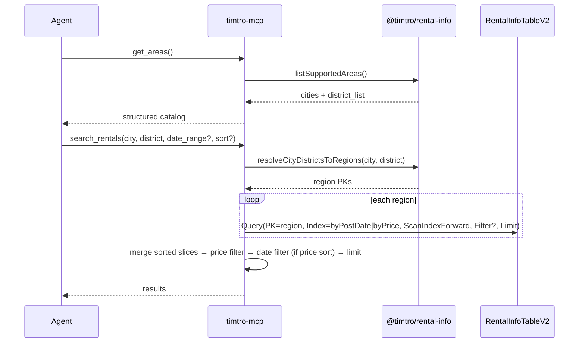

# feat: Search filters and get_areas MCP tool

## Summary

Extend `@timtro/rental-info` with explicit city+district resolution and a static area catalog; add `get_areas` and enhanced `search_rentals` params (`city`, `district`, `date_range`, `sort`); and introduce **`RentalInfoTableV2`** with LSIs on `postDate` and `price` so sort/date queries use DynamoDB index order instead of application-layer over-fetch. The existing `RentalInfoTable` (v1) **stays in the SAM template** — only env/IAM wiring switches crawler writes and MCP reads to v2.

---

## Problem Frame

Agents using `timtro-mcp` today pass free-text `area_query` that resolves only to HCMC districts via alias matching. There is no way to discover supported cities/districts programmatically, no explicit city parameter, and no way to restrict or sort results efficiently — the v1 DynamoDB table has no indexes on `postDate` or `price`, forcing application-layer sort and over-fetch.

---

## Requirements

- R1. Add optional `date_range` (number of days) to `search_rentals`; e.g. `date_range = 5` returns listings posted within the last 5 days.
- R2. Replace `area_query` with required `city` and `district` parameters on `search_rentals`.
- R3. `district` accepts multiple values separated by comma (e.g. `binh_thanh,thu_duc` or label/alias forms resolved via existing mapping).
- R4. Add `get_areas` MCP tool returning a list of cities, each with `city`, `city_label`, and `district_list` (`district`, `district_label`).
- R5. Preserve existing price and limit behavior (`max_price_vnd`, `limit`, `strict_price_filter`).
- R6. Update server instructions and smoke script to reflect the new tool surface.
- R7. Add optional `sort` param to `search_rentals` with format `<field>|<order>` where `field` is `date` or `price` and `order` is `asc` or `desc` (e.g. `date|desc`, `price|asc`). Default `date|desc` when omitted.
- R8. Create `RentalInfoTableV2` with PK=`region`, SK=`id`, and LSIs on `postDate` and `price`; retain existing `RentalInfoTable` (v1) in SAM; point crawler and MCP to v2 via `RENTAL_INFO_TABLE_NAME`.

---

## Scope Boundaries

- Removing or migrating data from `RentalInfoTable` (v1) — v1 remains deployed but unused after cutover.
- Sub-area / street-level text filtering beyond district alias resolution (explicitly deferred in prior alignment plan).
- Backward compatibility for `area_query` — breaking change is acceptable (consistent with `2026-05-24-001-feat-mcp-rental-info-alignment-plan.md`).
- README overhaul beyond MCP/crawler env references touched by this work.

### Deferred to Follow-Up Work

- Production MCP deployment docs / Cursor config updates: separate ops task.
- **Backfill v1 → v2** — optional one-off script if historical listings must appear in v2 before the next crawl cycle.
- Decommission v1 table after v2 is stable and v1 data is no longer needed (separate SAM change — cannot remove v1 in the same deploy that adds v2 per CloudFormation/SAM constraint noted by user).

---

## Context & Research

### Relevant Code and Patterns

- Tool registration: `apps/timtro-mcp/src/server.ts`, `apps/timtro-mcp/src/tools/search_rentals.tool.ts`
- Search orchestration: `apps/timtro-mcp/src/services/rental-search.service.ts`
- Area resolution (to refactor): `libs/rental-info/src/area-query.ts`
- City/district catalog (private today): `libs/rental-info/src/region-mapping.ts`
- Data contract: `docs/spec/data-models.md` — `region = {city}_{district}`, `postDate` ISO 8601
- Prior alignment plan: `docs/plans/2026-05-24-001-feat-mcp-rental-info-alignment-plan.md` — fan-out by region PK, post-query price filter, sort by `postDate` desc

### Institutional Learnings

- No `docs/solutions/` entries yet; prior alignment plan documents accepted patterns: empty results (not errors) for unresolvable location, AWS errors propagate.
- **v1 limitation:** per-region `Query` on base table SK=`id` cannot return date/price-ordered results — addressed by v2 LSIs.

### External References

- None required — local patterns are sufficient.

### DynamoDB Table Design (v1 → v2)

**Current `RentalInfoTable` (v1)** — retained, not deleted:

| Key | Attribute | Type |
|-----|-----------|------|
| PK | `region` | S |
| SK | `id` | S |
| LSIs / GSIs | — | none |

**New `RentalInfoTableV2`** — `timtro-rental-info-v2-${EnvironmentName}`:

| Key | Attribute | Type | Role |
|-----|-----------|------|------|
| PK (HASH) | `region` | S | Same as v1 — `{city}_{district}` |
| SK (RANGE) | `id` | S | Same as v1 — `fb_{postId}`; used for crawler `Put` upsert |
| LSI `byPostDate` | SK=`postDate` | S | ISO 8601; lexicographic sort = chronological |
| LSI `byPrice` | SK=`price` | N | Monthly rent VND; `-1` = unknown |

Both LSIs share PK=`region`. Item attributes unchanged — `postDate` and `price` already exist on `RentalInfo`; no domain model change in `@timtro/rental-info`.

**Why a new table (not alter v1):** LSIs must be defined at table creation; DynamoDB does not allow adding LSIs to an existing table. User constraint: keep v1 resource in SAM (do not remove in the same stack update that introduces v2).

**Cutover wiring:**

| Component | Change |
|-----------|--------|
| `Globals.Function.Environment.RENTAL_INFO_TABLE_NAME` | `!Ref RentalInfoTable` → `!Ref RentalInfoTableV2` |
| `SanitizeFunction` IAM | `PutItem` on v2 ARN (drop v1 write permission) |
| `apps/timtro-crawler` code | No logic change — writes via `config.rentalInfoTableName` from env |
| `apps/timtro-mcp` repository | Query v2 LSIs based on `sort` / `date_range` |
| v1 `RentalInfoTable` resource | **Keep** in `template.yaml`; no references after cutover |

**Query mapping (MCP repository):**

| Request | Index | ScanIndexForward | FilterExpression (when needed) |
|---------|-------|------------------|--------------------------------|
| `date\|desc` (default) | `byPostDate` | `false` | `postDate >= :cutoff` if `date_range` set |
| `date\|asc` | `byPostDate` | `true` | same |
| `price\|asc` | `byPrice` | `true` | `price > :zero` to exclude unknown (`-1`) |
| `price\|desc` | `byPrice` | `false` | `price > :zero` |
| Upsert / point read (crawler) | base table | — | `PutItem` on PK=`region`, SK=`id` |

**Multi-district merge:** Each region query returns a sorted slice (up to `limit` per region from LSI). Service merges regions with a k-way merge (or re-sort merged set — simpler, acceptable at district counts ≤ ~24). Global `limit` applied after merge.

**Unknown price on price LSI:** Items with `price = -1` sort to the bottom of ascending order in the index. Exclude via `FilterExpression price > 0` on price-index queries; optionally append unknown-price rows after merge when `strict_price_filter` is false (match existing price-filter semantics).

---

## Key Technical Decisions

- **`RentalInfoTableV2` with LSIs (R8):** New SAM resource alongside v1. Base keys unchanged (`region` + `id`) so crawler `Put` semantics stay the same. LSIs `byPostDate` and `byPrice` enable index-ordered queries for MCP sort. v1 table resource left in template; env ref switches to v2 only.
- **Breaking `area_query` removal:** Replace with explicit `city` + `district` params. Agents call `get_areas` first to discover valid keys/labels.
- **District resolution in shared lib:** Add `resolveCityDistrictsToRegions(city: string, district: string)` in `@timtro/rental-info`. Split `district` on comma only; trim and dedupe tokens.
- **`get_areas` from static catalog:** Export `listSupportedAreas()` from `region-mapping.ts`. No DynamoDB read.
- **`sort` via LSI queries:** Repository selects `byPostDate` or `byPrice` index and `ScanIndexForward` from parsed `sort` param. Default `date|desc` → `byPostDate`, `ScanIndexForward=false`.
- **`date_range` via FilterExpression on date LSI:** When set, add `postDate >= :cutoff` to the `byPostDate` index query (works regardless of sort field if sort is date-based; if sort is price-based, apply date filter post-query or require `date|*` sort — **default: date filter as FilterExpression on whichever index is queried; when sort is price, apply date filter after fetch**).
- **Price LSI excludes unknowns:** `FilterExpression price > 0` on `byPrice` queries. Unknown-price rows appended after merge only when price filter semantics allow (non-strict).
- **Multi-district merge:** k-way merge of per-region LSI-sorted slices, then global `limit`. Per-region fetch `limit` (not over-fetch multiplier) — LSIs return correctly ordered top-N per region.
- **Unresolvable location semantics:** Unknown city or all districts fail → empty results, no error.
- **District input accepts aliases:** Via existing `resolveDistrict`.

---

## Open Questions

### Resolved During Planning

- **Date window boundary:** Rolling window from current instant, inclusive of listings at the cutoff boundary (`>=`).
- **Multi-district separator:** Comma only, per requirements (not `;`/`|` from legacy `area_query`).
- **City required:** Yes — both `city` and `district` are required on `search_rentals`.
- **Default sort:** `date|desc` when `sort` omitted.
- **DynamoDB:** v2 table with LSIs; v1 retained in SAM, not referenced after cutover.
- **`date_range` + `sort=price`:** Date window applied post-fetch when sort uses price LSI (acceptable; document in tool description).

### Deferred to Implementation

- **k-way merge vs re-sort:** Prefer k-way merge for multi-district; fall back to in-memory sort if simpler and district count stays small.
- **Backfill script scope:** Only if product requires v1 data in v2 before next crawl.

---

## High-Level Technical Design

> *This illustrates the intended approach and is directional guidance for review, not implementation specification. The implementing agent should treat it as context, not code to reproduce.*



**Filter pipeline order:** LSI query (sorted) → merge → price filter → date filter (when sort is price-based) → global `limit`.

**Sort grammar (directional):**

```
sort := field "|" order
field := "date" | "price"
order := "asc" | "desc"
```

---

## Implementation Units

- U1. **Add `RentalInfoTableV2` to SAM and cut over env/IAM**

**Goal:** Define v2 table with LSIs; switch `RENTAL_INFO_TABLE_NAME` to v2; keep v1 table resource intact.

**Requirements:** R8

**Dependencies:** None

**Files:**
- Modify: `apps/timtro-crawler/template.yaml`
- Modify: `apps/timtro-crawler/test/infra/template-shape.test.ts`
- Modify: `docs/spec/data-models.md`

**Approach:**
- Add `RentalInfoTableV2` resource: `TableName: timtro-rental-info-v2-${EnvironmentName}`; PK=`region`, SK=`id`; LSIs `byPostDate` (SK=`postDate`, S) and `byPrice` (SK=`price`, N); `ProjectionType: ALL`; same billing/PITR/SSE as v1.
- **Do not remove** existing `RentalInfoTable` resource.
- Change `Globals.Function.Environment.RENTAL_INFO_TABLE_NAME` from `!Ref RentalInfoTable` to `!Ref RentalInfoTableV2`.
- Update `SanitizeFunction` policy: `dynamodb:PutItem` on `!GetAtt RentalInfoTableV2.Arn` (remove v1 PutItem grant).
- Document v2 table and LSIs in `docs/spec/data-models.md`; note v1 is legacy/retained.

**Patterns to follow:**
- Existing `RentalInfoTable` block in `template.yaml`
- `apps/timtro-crawler/test/infra/template-shape.test.ts`

**Test scenarios:**
- Happy path: template contains both `RentalInfoTable:` and `RentalInfoTableV2:`
- Happy path: template contains `byPostDate` and `byPrice` LSI names
- Happy path: `RENTAL_INFO_TABLE_NAME: !Ref RentalInfoTableV2`
- Happy path: v1 table definition unchanged (still present)

**Verification:**
- `pnpm test` (crawler infra tests) passes; SAM template validates

---

- U2. **Extend `@timtro/rental-info` resolution and catalog**

**Goal:** Provide shared functions for city+district → region PK resolution and static area catalog for `get_areas`.

**Requirements:** R2, R3, R4

**Dependencies:** None

**Files:**
- Modify: `libs/rental-info/src/area-query.ts`
- Modify: `libs/rental-info/src/region-mapping.ts`
- Modify: `libs/rental-info/src/index.ts`
- Test: `libs/rental-info/test/area-query.test.ts`
- Create: `libs/rental-info/test/area-catalog.test.ts`

**Approach:**
- Add `resolveCityDistrictsToRegions(city: string, district: string)` — resolve city via `resolveCity`; split district on comma; resolve each token via `resolveDistrict`; dedupe; build regions with `buildRegion`.
- Add `listSupportedAreas()` from `CITY_ENTRIES` + `DISTRICT_ENTRIES`.
- Remove `resolveAreaQueryToRegions` if no callers remain after MCP migration.
- Export new functions from `index.ts`.

**Patterns to follow:**
- `libs/rental-info/src/area-query.ts`, `libs/rental-info/test/area-query.test.ts`

**Test scenarios:**
- Happy path: `resolveCityDistrictsToRegions("ho_chi_minh", "binh_thanh,thu_duc")` → two region PKs
- Happy path: labels/aliases work
- Edge case: blank district, duplicate districts, unknown city, mixed valid/invalid tokens
- Happy path: `listSupportedAreas()` includes `ho_chi_minh` with full district list

**Verification:**
- `pnpm test:lib` passes

---

- U3. **LSI-aware MCP repository**

**Goal:** Query `RentalInfoTableV2` via the appropriate LSI for sort; support date filter on date index.

**Requirements:** R7, R8

**Dependencies:** U1

**Files:**
- Modify: `apps/timtro-mcp/src/services/rental-info.repository.ts`
- Test: `apps/timtro-mcp/test/rental-info.repository.test.ts`

**Approach:**
- Extend `RentalInfoRepository` with query options: `{ limit, sort: { field, order }, dateRangeCutoff?: string }`.
- Map sort to index + `ScanIndexForward`:
  - `date|desc` → `IndexName: byPostDate`, `ScanIndexForward: false`
  - `date|asc` → `byPostDate`, `true`
  - `price|asc` → `byPrice`, `true`, `FilterExpression: price > :zero`
  - `price|desc` → `byPrice`, `false`, `FilterExpression: price > :zero`
- When `dateRangeCutoff` set and index is `byPostDate`, combine with `FilterExpression postDate >= :cutoff`.
- Keep pagination via `LastEvaluatedKey`; row validation via `rentalInfoSchema.safeParse`.

**Patterns to follow:**
- Existing `queryByRegion` in `rental-info.repository.ts`

**Test scenarios:**
- Happy path: date sort query uses `byPostDate` index and correct `ScanIndexForward`
- Happy path: price sort query uses `byPrice` index with `price > 0` filter
- Happy path: date_range adds `postDate >= cutoff` on date index query
- Happy path: pagination merges pages up to limit
- Edge case: empty region returns `[]`
- Error path: DynamoDB rejection propagates

**Verification:**
- Repository tests pass with mocked `QueryCommand` payloads asserting `IndexName` and `ScanIndexForward`

---

- U4. **Update `RentalSearchService` for city/district, date_range, and sort**

**Goal:** Wire new params; delegate sorted fetch to LSI repository; merge multi-region results.

**Requirements:** R1, R2, R3, R5, R7

**Dependencies:** U2, U3

**Files:**
- Modify: `apps/timtro-mcp/src/services/rental-search.service.ts`
- Modify: `apps/timtro-mcp/src/search-rentals.ts`
- Test: `apps/timtro-mcp/test/rental-search.service.test.ts`

**Approach:**
- Change `SearchParams`: `city`, `district`, optional `dateRangeDays`, optional `sort` (default `date|desc`).
- Resolve regions via `resolveCityDistrictsToRegions`.
- Pass sort + cutoff to repository per region; fetch up to `limit` per region from LSI.
- Merge multi-region sorted slices (k-way merge or re-sort); apply `matchesPriceFilter`; if sort is price-based and `dateRangeDays` set, post-filter by date.
- Global `limit` slice; map to output.

**Patterns to follow:**
- Existing `matchesPriceFilter`, `toSearchResultItem`, multi-region tests

**Test scenarios:**
- Happy path: single district + default `date|desc`
- Happy path: multi-district merge preserves global sort order
- Happy path: `price|asc` returns lowest prices first
- Happy path: `dateRangeDays` excludes old listings (date index path)
- Happy path: `dateRangeDays` + `price|asc` applies date filter post-fetch
- Edge case: unresolvable location → empty, repository not called
- Happy path: price filter + sort combined
- Error path: repository rejection propagates

**Verification:**
- Service tests pass with mocked repository returning LSI-ordered fixtures

---

- U5. **Update `search_rentals` MCP tool contract**

**Goal:** Expose new input schema; remove `area_query`.

**Requirements:** R1, R2, R3, R5, R7

**Dependencies:** U4

**Files:**
- Modify: `apps/timtro-mcp/src/tools/search_rentals.tool.ts`

**Approach:**
- Input: required `city`, required `district` (comma-separated), optional `date_range`, optional `sort` (`<field>|<order>`), retain price/limit params.
- Zod-validate `sort` format; default `date|desc`.
- Update description: references v2 table, LSIs, `get_areas` discovery flow.
- Output schema unchanged.

**Test scenarios:**
- Test expectation: none — covered by service tests + smoke (U7)

**Verification:**
- Tool compiles; smoke script succeeds

---

- U6. **Add `get_areas` MCP tool**

**Goal:** Register tool returning supported cities and districts.

**Requirements:** R4

**Dependencies:** U2

**Files:**
- Create: `apps/timtro-mcp/src/tools/get_areas.tool.ts`
- Modify: `apps/timtro-mcp/src/server.ts`
- Test: `apps/timtro-mcp/test/get_areas.tool.test.ts` (optional)

**Approach:**
- Call `listSupportedAreas()`; map to `{ cities: [{ city, city_label, district_list }] }`.
- Register in `server.ts`.

**Test scenarios:**
- Happy path: returns `ho_chi_minh` with non-empty `district_list`
- Happy path: stable/deterministic ordering

**Verification:**
- Tool registered; smoke script lists areas

---

- U7. **Update server instructions, smoke script, and docs**

**Goal:** Align agent-facing docs and local verification with v2 table and new tool surface.

**Requirements:** R6, R8

**Dependencies:** U5, U6

**Files:**
- Modify: `apps/timtro-mcp/src/server.ts`
- Modify: `scripts/smoke-call.mjs`
- Modify: `apps/timtro-crawler/README.md` (table name note)
- Modify: `docs/spec/data-models.md` (if not fully covered in U1)

**Approach:**
- Instructions: `get_areas` first; `search_rentals` with new params; note v2 table via `RENTAL_INFO_TABLE_NAME`.
- Smoke script: `get_areas` + `search_rentals` with new params and a sort variant.
- Document deploy note: after SAM deploy, v2 starts filling on next crawl; v1 data not auto-migrated.

**Test scenarios:**
- Test expectation: none — manual/smoke verification

**Verification:**
- Smoke script runs against v2 table

---

## System-Wide Impact

- **Interaction graph:** Crawler `SanitizeFunction` writes to v2 via unchanged `DynamoRentalInfoStore.put` + env table name. MCP reads v2 via LSI queries. v1 table orphaned but deployed.
- **Error propagation:** DynamoDB and Zod row validation behavior unchanged.
- **State lifecycle risks:** v2 empty until first post-deploy crawl/sanitize — document cutover gap; optional backfill deferred.
- **API surface parity:** MCP breaking change (`area_query` removed); env var name unchanged (`RENTAL_INFO_TABLE_NAME`) but value points to v2 table.
- **Integration coverage:** SAM infra tests, repository LSI tests, service merge tests, smoke script.
- **Unchanged invariants:** `RentalInfo` item shape, price filter semantics, `UNKNOWN_RENTAL_PRICE` handling, output result shape, crawler Put keyed by `region` + `id`.

---

## Risks & Dependencies

| Risk | Mitigation |
|------|------------|
| v2 empty after deploy until next crawl | Document cutover; optional v1→v2 backfill script deferred |
| SAM stack update fails if v1 removed alongside v2 add | Keep v1 resource; only repoint env/IAM (U1) |
| `price = -1` clusters at bottom of price LSI asc | `FilterExpression price > 0` on price index queries |
| `date_range` + `price` sort requires post-fetch date filter | Document limitation; acceptable at current scale |
| Multi-district global sort incorrect after per-region LSI limit | k-way merge or re-sort merged set (U4) |
| Agents break on removed `area_query` | `get_areas` + updated server instructions |
| Invalid `sort` string confuses agents | Zod validation; document format in tool description |
| LSI write amplification on crawler puts | Expected cost of index maintenance; on-demand billing |

---

## Documentation / Operational Notes

- Note breaking MCP contract change for configured Cursor MCP clients.
- **Deploy sequence:** `sam deploy` creates v2 table; crawler/MCP automatically use v2 name via env. v1 data remains in old table until backfill or decommission.
- Local dev: update `events/*.json` env overrides to v2 table name if testing against deployed stack.
- Update `docs/spec/data-models.md` with v2 table, LSIs, and access patterns.
- Consider `/ce-compound` after merge to capture LSI cutover learning.

---

## Sources & References

- **Origin document:** [docs/assets/requirements.md](../assets/requirements.md)
- Data spec: [docs/spec/data-models.md](../spec/data-models.md)
- Prior plan: [docs/plans/2026-05-24-001-feat-mcp-rental-info-alignment-plan.md](2026-05-24-001-feat-mcp-rental-info-alignment-plan.md)
- SAM template: `apps/timtro-crawler/template.yaml`
- Crawler store: `apps/timtro-crawler/src/services/aws-clients.ts`
- MCP repository: `apps/timtro-mcp/src/services/rental-info.repository.ts`
