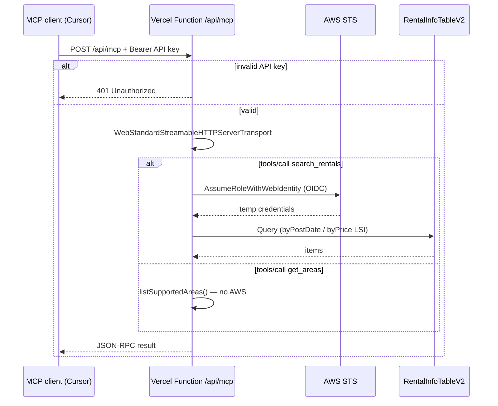

# feat: Streamable HTTP MCP on Vercel with SAM IAM role

## Summary

Replace stdio-only `timtro-mcp` with a **Streamable HTTP** MCP server deployed on **Vercel**, protected by a simple **API key**, and reading `RentalInfoTableV2` via **temporary AWS credentials** from an IAM role defined in a new **SAM stack** under `apps/timtro-mcp`. The SAM stack grants least-privilege DynamoDB read access and trusts Vercel OIDC; Vercel env vars wire the role ARN, table name, and API key.

---

## Problem Frame

`timtro-mcp` today runs as a local stdio subprocess (`StdioServerTransport` in `apps/timtro-mcp/src/server.ts`). Remote MCP clients (Cursor, Claude Desktop, other hosts) cannot connect without cloning the repo, building, and supplying AWS credentials locally. Prior plans (`2026-05-24-001`, `2026-05-24-002`) explicitly deferred production MCP deployment. The DynamoDB data path is ready; the transport and cross-cloud AWS access layer are not.

---

## Requirements

- R1. Remove stdio transport entirely; expose MCP only over **Streamable HTTP**.
- R2. Deploy the HTTP MCP server on **Vercel** (serverless functions).
- R3. Protect the remote endpoint with a simple **API key** (`Authorization: Bearer`); OAuth 2.1 is deferred.
- R4. Add a **SAM template** in `apps/timtro-mcp` that creates an IAM role with **read-only DynamoDB Query** access to `RentalInfoTableV2` and its LSIs.
- R5. Configure Vercel to assume that IAM role via **OIDC federation** (no long-lived AWS access keys in Vercel env).
- R6. Preserve existing tool behavior: `get_areas` (static catalog) and `search_rentals` (DynamoDB LSI queries).
- R7. Update smoke tests, Nx targets, and client configuration docs for HTTP URL transport.
- R8. Document deployment sequencing: crawler table → SAM IAM stack → Vercel env → Vercel deploy.

---

## Scope Boundaries

- OAuth 2.1 / RFC 9728 protected-resource metadata (future extension only).
- Amplify Hosting or Amplify Gen 2 as MCP host (evaluated, not chosen — see Platform Feasibility).
- AWS Lambda MCP deployment (evaluated as alternative, not primary for this plan).
- Crawler stack changes beyond optional `Outputs` for table ARN/name export.
- WAF, rate limiting, API key rotation automation, and production monitoring dashboards.
- MCP protocol version `2026-07-28` RC (target current stable SDK + `2025-11-25` client behavior).

### Deferred to Follow-Up Work

- OAuth 2.1 auth with `withMcpAuth`-style flow when `@modelcontextprotocol/express` ships bearer helpers in stable v2.
- Preview-environment data isolation (separate dev table + role per Vercel preview) — v1 uses production Vercel → dev/prod table mapping documented explicitly.
- Crawler stack `Outputs` export for cross-stack `Fn::ImportValue` (optional hardening; v1 uses parameterized table name matching crawler naming convention).

---

## Context & Research

### Relevant Code and Patterns

- Current stdio entry: `apps/timtro-mcp/src/server.ts`
- Tool registration: `apps/timtro-mcp/src/tools/get_areas.tool.ts`, `apps/timtro-mcp/src/tools/search_rentals.tool.ts`
- DynamoDB read path: `apps/timtro-mcp/src/services/rental-info.repository.ts` — `createDocumentClient()` uses default credential chain today
- Crawler SAM pattern: `apps/timtro-crawler/template.yaml`, `apps/timtro-crawler/samconfig.toml` (`ap-southeast-1`, `EnvironmentName` param)
- Infra shape tests: `apps/timtro-crawler/test/infra/template-shape.test.ts`
- Stale stdio smoke: `scripts/smoke-call.mjs`
- MCP SDK: `@modelcontextprotocol/server ^2.0.0-alpha.2` — use `WebStandardStreamableHTTPServerTransport` for Vercel route handlers (Web `Request`/`Response` API)

### Institutional Learnings

- `docs/solutions/` is empty; prior plans consistently deferred MCP deployment and isolated crawler infra from MCP (`2026-05-19-001`).
- AWS errors must propagate as tool errors, not silent empty results (`2026-05-24-001`).
- Vite `ssr.noExternal: true` bundles workspace libs — Vercel deployment must preserve `@timtro/rental-info` resolution (monorepo root install or Vercel `installCommand`).

### Platform Feasibility (requested research)

Priority order requested: Amplify → Vercel → others. **User decision: Vercel primary.** Assessment retained for traceability.

| Platform | Feasibility | Fit for timtro-mcp | Verdict |
|----------|-------------|-------------------|---------|
| **Vercel** | **High** | Official MCP deploy docs; serverless functions; built-in AWS OIDC (`AWS_ROLE_ARN` + web identity token); stateless Streamable HTTP fits tool call pattern | **Chosen** |
| **AWS Amplify Hosting** | **Low** | Hosts web apps (SSR/SSG), not arbitrary MCP HTTP backends; Amplify MCP Server is AWS's managed guidance product, not a deploy target | **Not suitable** |
| **Amplify Gen 2 + Lambda** | **Medium** | Could deploy a Lambda function URL via CDK in Amplify backend, but duplicates SAM patterns already used by crawler; no advantage over SAM+Lambda or Vercel for this use case | **Not chosen** |
| **AWS Lambda + SAM (extend crawler stack)** | **High** | Same region as DynamoDB (`ap-southeast-1`); Function URL + stateless Streamable HTTP; IAM colocated with table; no cross-cloud latency | **Strong alternative** — simpler AWS-only ops, but user chose Vercel |
| **Fly.io / Railway (container)** | **Medium** | Long-running Node HTTP server; needs static AWS keys or OIDC workaround; operational overhead vs serverless | **Fallback** if Vercel limits block |
| **Cloudflare Workers** | **Medium** | Web Standard transport works; cross-region DynamoDB latency from edge; OIDC to AWS is non-trivial | **Not recommended** |

**Vercel tradeoffs accepted:** cross-cloud hop (Vercel → AWS `ap-southeast-1` DynamoDB), function timeout/cold-start budget, OIDC trust-policy setup. **Mitigation:** stateless JSON responses, credential provider singleton per warm instance, `maxDuration` ≥ 30s, table region pinned in `AWS_REGION`.

### External References

- [MCP Streamable HTTP transport spec](https://modelcontextprotocol.io/specification/2025-06-18/basic/transports)
- [Vercel: Deploy MCP servers](https://vercel.com/docs/mcp/deploy-mcp-servers-to-vercel) — uses `mcp-handler` (v1 SDK); **this plan uses official v2 SDK instead** (incompatible with `mcp-handler`)
- [Vercel: Connect to AWS via OIDC](https://vercel.com/docs/oidc/aws)
- [MCP TypeScript SDK v2 server guide](https://ts.sdk.modelcontextprotocol.io/v2/documents/Documents.Server_Guide.html)
- [Stateless Streamable HTTP example](https://github.com/modelcontextprotocol/typescript-sdk/blob/main/examples/server/src/honoWebStandardStreamableHttp.ts)

---

## Key Technical Decisions

- **HTTP-only cutover:** Remove `StdioServerTransport`, Vite stdio bundle entry, stdio smoke script, and `mcp-inspector` stdio target. Local dev uses `vercel dev` or equivalent HTTP server against the same route handler.
- **Official MCP v2 SDK, not `mcp-handler`:** `mcp-handler@1.x` pins `@modelcontextprotocol/sdk` v1 and conflicts with `@modelcontextprotocol/server ^2.0.0-alpha.2`. Implement route handler with `WebStandardStreamableHTTPServerTransport` directly.
- **Stateless Streamable HTTP:** `sessionIdGenerator: undefined` — required for Vercel serverless (no in-memory session map, no sticky sessions). Prefer JSON responses over SSE for tool calls unless a client requires streaming.
- **API key auth at HTTP boundary:** Validate `Authorization: Bearer <MCP_API_KEY>` before calling `transport.handleRequest`. Return HTTP 401 (not MCP JSON-RPC error) when missing/invalid. Pass validated token as `AuthInfo` into transport. In local dev, skip auth when `MCP_API_KEY` is unset (non-production only).
- **SAM stack in `apps/timtro-mcp` (not crawler stack):** Keeps MCP deployment concerns isolated per monorepo convention. Crawler stack owns the table; MCP stack owns cross-cloud read role.
- **Table reference via parameter:** SAM parameter `RentalInfoTableName` defaulting to `timtro-rental-info-v2-${EnvironmentName}` (matches crawler `!Sub` pattern). Construct table and index ARNs in IAM policy with `!Sub`. Optional follow-up: add crawler `Outputs` for import.
- **Vercel OIDC credential chain:** When `AWS_ROLE_ARN` is set, use Vercel's OIDC AWS credentials provider (`@vercel/functions/oidc` `awsCredentialsProvider`) in `createDocumentClient()`. Local fallback: existing default credential chain (`AWS_PROFILE`, access keys).
- **Do not use long-lived AWS access keys in Vercel env** — OIDC only for production-like environments.

---

## Open Questions

### Resolved During Planning

- **Dual transport?** No — HTTP-only per user direction.
- **Deployment platform?** Vercel (not Amplify).
- **AWS access pattern?** SAM IAM role + Vercel OIDC assume-role.
- **Auth?** API key now; OAuth 2.1 later.
- **Stateless vs stateful HTTP?** Stateless for Vercel.
- **API key header?** `Authorization: Bearer`.

### Deferred to Implementation

- Exact Vercel project root (`apps/timtro-mcp` vs monorepo root with `rootDirectory` setting) — depends on Nx + pnpm workspace resolution during Vercel build.
- Whether to keep Vite build for anything after stdio removal (likely drop Vite for MCP app; Vercel compiles TypeScript API routes natively).
- Preview deployment trust-policy scope (start production-only; widen if preview testing needed).

---

## High-Level Technical Design

> *This illustrates the intended approach and is directional guidance for review, not implementation specification. The implementing agent should treat it as context, not code to reproduce.*



**Deploy topology:**

```
apps/timtro-crawler (existing)          apps/timtro-mcp (new SAM)
├── RentalInfoTableV2                   ├── VercelOidcReadRole
└── writes rental data                  └── dynamodb:Query on table + indexes
                                                    ↑
                                            Vercel OIDC assumes role
                                                    ↑
apps/timtro-mcp (Vercel app) ───────────────────────┘
└── api/mcp/route.ts (Streamable HTTP)
```

---

## Output Structure

```
apps/timtro-mcp/
├── api/
│   └── mcp/
│       └── route.ts          # Vercel serverless entry (GET/POST/DELETE)
├── src/
│   ├── create-mcp-server.ts  # McpServer factory + tool registration
│   ├── auth/
│   │   └── api-key.ts        # Bearer token validation → AuthInfo
│   ├── aws/
│   │   └── credentials.ts    # Vercel OIDC vs local default chain
│   ├── services/             # existing (repository updated)
│   └── tools/                # existing
├── template.yaml             # SAM: IAM role + policies (no Lambda)
├── samconfig.toml
├── vercel.json
├── env.example.json          # parameter template for SAM deploy
└── test/
    ├── infra/
    │   └── template-shape.test.ts
    └── ...                   # existing unit tests
```

---

## Implementation Units

- U1. **Extract MCP server factory and remove stdio entry**

**Goal:** Decouple tool registration from transport so the Vercel route handler can reuse the same server instance wiring.

**Requirements:** R1, R6

**Dependencies:** None

**Files:**
- Create: `apps/timtro-mcp/src/create-mcp-server.ts`
- Delete: `apps/timtro-mcp/src/server.ts`
- Modify: `apps/timtro-mcp/vite.config.ts` (remove or delete if Vite no longer needed)
- Modify: `apps/timtro-mcp/project.json` (remove `serve`, `dev` stdio targets, `inspector` stdio target)

**Approach:**
- Move `McpServer` construction, `instructions`, and tool registration into `createTimtroMcpServer()` factory returning configured `McpServer`.
- Delete stdio entry point entirely.

**Patterns to follow:**
- Tool registration pattern in current `apps/timtro-mcp/src/server.ts`
- Factory pattern used implicitly in Vercel MCP examples

**Test scenarios:**
- Happy path: `createTimtroMcpServer()` returns server with `get_areas` and `search_rentals` registered (lightweight registration test or existing tool tests still pass)
- Edge case: factory is pure — no env var reads at module load

**Verification:**
- No remaining imports of `StdioServerTransport` in the app
- Existing tool/service unit tests pass unchanged

---

- U2. **Implement Vercel Streamable HTTP route handler**

**Goal:** Expose MCP at `/api/mcp` using stateless Streamable HTTP suitable for Vercel serverless functions.

**Requirements:** R1, R2, R6

**Dependencies:** U1

**Files:**
- Create: `apps/timtro-mcp/api/mcp/route.ts`
- Create: `apps/timtro-mcp/vercel.json`
- Modify: `apps/timtro-mcp/package.json` (ensure `"type": "module"`, add `@vercel/functions` if needed)
- Modify: `apps/timtro-mcp/project.json` (add `dev:http` → `vercel dev`, update `build` if applicable)

**Approach:**
- Create module-level singleton: `McpServer` + `WebStandardStreamableHTTPServerTransport` with `sessionIdGenerator: undefined`.
- Connect server to transport once at cold start; reuse across invocations in same instance.
- Export `GET`, `POST`, `DELETE` handlers delegating to `transport.handleRequest(req, { authInfo })`.
- Set `maxDuration` in `vercel.json` (≥ 30 seconds) for cold start + DynamoDB query budget.
- Configure monorepo install: Vercel project `Root Directory` = `apps/timtro-mcp` or repo root with appropriate `installCommand` for pnpm workspace.

**Technical design:** *(directional)*

```
on module load:
  server = createTimtroMcpServer()
  transport = WebStandardStreamableHTTPServerTransport({ sessionIdGenerator: undefined })
  await server.connect(transport)

per request:
  authInfo = validateApiKey(req) ?? return 401
  return transport.handleRequest(req, { authInfo })
```

**Patterns to follow:**
- [honoWebStandardStreamableHttp.ts](https://github.com/modelcontextprotocol/typescript-sdk/blob/main/examples/server/src/honoWebStandardStreamableHttp.ts) — stateless pattern
- [Vercel MCP deploy docs](https://vercel.com/docs/mcp/deploy-mcp-servers-to-vercel) — route export shape (adapt for v2 SDK)

**Test scenarios:**
- Happy path: POST initialize with valid API key returns InitializeResult
- Happy path: POST tools/call `get_areas` returns catalog
- Edge case: GET request handled (SSE stream initiation or appropriate response per SDK)
- Error path: missing `Authorization` header → HTTP 401 before MCP processing
- Error path: wrong bearer token → HTTP 401
- Integration: Cursor config `{ "url": "https://…/api/mcp", "headers": { "Authorization": "Bearer …" } }` connects (manual verification)

**Verification:**
- `vercel dev` serves `/api/mcp` locally
- MCP Inspector connects via Streamable HTTP URL

---

- U3. **Add API key authentication module**

**Goal:** Centralize bearer token validation and `AuthInfo` construction.

**Requirements:** R3

**Dependencies:** U2

**Files:**
- Create: `apps/timtro-mcp/src/auth/api-key.ts`
- Test: `apps/timtro-mcp/test/api-key.test.ts`

**Approach:**
- Read `MCP_API_KEY` from env.
- `validateApiKey(request: Request): AuthInfo | undefined` — parse `Authorization: Bearer <token>`, constant-time compare.
- When `MCP_API_KEY` unset and `NODE_ENV !== 'production'`, return synthetic `AuthInfo` (local dev bypass).
- When unset in production, reject all requests.

**Test scenarios:**
- Happy path: matching bearer token returns `AuthInfo`
- Error path: missing header → undefined
- Error path: wrong token → undefined
- Edge case: dev bypass when key unset in non-production
- Edge case: production with unset key → all requests rejected

**Verification:**
- Auth tests pass; route handler returns 401 for invalid auth

---

- U4. **Wire Vercel OIDC AWS credentials into DynamoDB client**

**Goal:** Allow Vercel-deployed functions to query DynamoDB using the SAM-created IAM role without static AWS keys.

**Requirements:** R5, R6

**Dependencies:** U5 (role ARN known for integration testing; can implement with env stub first)

**Files:**
- Create: `apps/timtro-mcp/src/aws/credentials.ts`
- Modify: `apps/timtro-mcp/src/services/rental-info.repository.ts`
- Test: `apps/timtro-mcp/test/rental-info.repository.test.ts` (extend or add credentials unit test)

**Approach:**
- When `AWS_ROLE_ARN` is set, configure `DynamoDBClient` with Vercel OIDC credentials provider (`awsCredentialsProvider({ roleArn })` from `@vercel/functions/oidc`).
- Always set `region` from `AWS_REGION` (default `ap-southeast-1` to match crawler).
- When `AWS_ROLE_ARN` unset, keep current default credential chain for local dev.
- Lazy-init singleton `DynamoDBDocumentClient` per function instance to reuse assumed credentials within warm window (~1h).
- Surface AWS `AccessDenied` / STS failures as MCP tool errors with `isError: true`, not empty search results.

**Patterns to follow:**
- [Vercel AWS OIDC docs](https://vercel.com/docs/oidc/aws)
- Existing `createDocumentClient()` / `createRentalInfoRepository()` in `rental-info.repository.ts`

**Test scenarios:**
- Happy path: mocked credentials provider passes through to DynamoDB client config
- Error path: STS failure propagates as thrown error caught by tool handler
- Edge case: local dev without `AWS_ROLE_ARN` uses default chain (no code path regression)
- Integration: deployed Vercel function successfully queries dev table (manual/post-deploy)

**Verification:**
- `search_rentals` returns data when Vercel env + SAM role correctly configured
- CloudTrail shows `AssumeRoleWithWebIdentity` from Vercel OIDC

---

- U5. **Add SAM IAM stack for Vercel OIDC DynamoDB read role**

**Goal:** Define least-privilege IAM role in AWS that Vercel can assume to query the rental info table.

**Requirements:** R4, R5, R8

**Dependencies:** Crawler stack deployed with `RentalInfoTableV2` (external prerequisite)

**Files:**
- Create: `apps/timtro-mcp/template.yaml`
- Create: `apps/timtro-mcp/samconfig.toml`
- Create: `apps/timtro-mcp/env.example.json` (SAM parameter overrides template)
- Create: `apps/timtro-mcp/test/infra/template-shape.test.ts`
- Modify: `apps/timtro-mcp/project.json` (add `sam:validate`, `deploy:iam` targets)
- Modify: root `package.json` (optional `mcp:deploy:iam` script)

**Approach:**
- SAM template contains **IAM resources only** (no Lambda) — this stack creates permissions, not compute.
- **Parameters:** `EnvironmentName` (default `dev`), `RentalInfoTableName` (default `timtro-rental-info-v2-${EnvironmentName}`), `VercelTeamSlug`, `VercelProjectName`, `AllowedVercelEnvironments` (comma list: `production`, `preview`).
- **Resources:**
  - `McpDynamoDbReadRole` — IAM role with trust policy for `sts:AssumeRoleWithWebIdentity` from `oidc.vercel.com/[TEAM_SLUG]`, conditioned on `aud` and `sub` matching Vercel project/environment claims.
  - Inline policy: `dynamodb:Query` and `dynamodb:DescribeTable` on `!Sub 'arn:aws:dynamodb:${AWS::Region}:${AWS::AccountId}:table/${RentalInfoTableName}'` and `…/index/*`.
  - Explicit deny on write actions (defense in depth).
- **Outputs:** `McpReadRoleArn`, `RentalInfoTableName` (echo parameter for Vercel env setup).
- **Region:** `ap-southeast-1` (match crawler `samconfig.toml`).
- Document one-time AWS account step: register Vercel OIDC identity provider if not already present (may be manual CLI/Console step outside SAM).

**Technical design:** *(directional)*

Trust policy conditions pin `sub` to `owner:[TEAM]:project:[PROJECT]:environment:production` initially; widen to preview via parameter if needed.

**Patterns to follow:**
- `apps/timtro-crawler/template.yaml` — parameter naming, `EnvironmentName`, SAM transform
- `apps/timtro-crawler/test/infra/template-shape.test.ts` — shape assertions
- Crawler SanitizeFunction DynamoDB policy — table ARN construction (MCP needs Query on indexes, not PutItem)

**Test scenarios:**
- Happy path: template contains role, trust policy with Vercel OIDC federated principal, Query on table + index ARNs
- Edge case: template does not create DynamoDB table (read-only consumer)
- Edge case: parameters include `VercelTeamSlug` and `VercelProjectName`
- Test expectation: none for CloudFormation deploy itself — validated via `sam validate` + shape tests

**Verification:**
- `sam validate` passes
- `nx run timtro-mcp:sam:validate` passes
- Deployed role ARN assumable from Vercel (CloudTrail confirmation)

---

- U6. **Replace smoke tests, Nx targets, and documentation**

**Goal:** Remove stdio workflow artifacts; document Vercel + SAM + Cursor HTTP config.

**Requirements:** R7, R8

**Dependencies:** U2, U3, U4, U5

**Files:**
- Create: `scripts/smoke-http.mjs` (or `apps/timtro-mcp/scripts/smoke-http.mjs`)
- Delete: `scripts/smoke-call.mjs`
- Modify: `apps/timtro-mcp/project.json` (`smoke` target → HTTP)
- Modify: root `package.json` (`smoke`, remove `inspector` or repoint to HTTP URL)
- Modify: `README.md`
- Create or modify: `apps/timtro-mcp/README.md`

**Approach:**
- HTTP smoke script: POST initialize → initialized notification → tools/call `get_areas` and `search_rentals` against `MCP_URL` env (default `http://localhost:3000/api/mcp`) with `Authorization: Bearer $MCP_API_KEY`.
- Document deploy sequence in README:
  1. Deploy crawler stack (table exists)
  2. Register Vercel OIDC provider (one-time)
  3. `sam deploy` MCP IAM stack
  4. Set Vercel env: `AWS_ROLE_ARN`, `AWS_REGION`, `RENTAL_INFO_TABLE_NAME`, `MCP_API_KEY`
  5. `vercel deploy`
  6. Configure Cursor: `{ "url": "https://<project>.vercel.app/api/mcp", "headers": { "Authorization": "Bearer <key>" } }`
- Remove all JSON cache / stdio references from root README.

**Test scenarios:**
- Happy path: smoke script parses JSON-RPC responses for initialize + both tool calls
- Edge case: smoke skips `search_rentals` assertion when AWS not configured (CI-friendly flag)
- Test expectation: none for README — manual review

**Verification:**
- `pnpm smoke` succeeds against local `vercel dev` with dev AWS setup
- README accurately describes HTTP-only MCP

---

## System-Wide Impact

- **Interaction graph:** MCP clients → Vercel `/api/mcp` → (OIDC) → DynamoDB `RentalInfoTableV2`. Crawler write path unchanged. `@timtro/rental-info` unchanged.
- **Error propagation:** API key failures → HTTP 401. AWS STS/DynamoDB failures → MCP tool error (not empty results). Zod row validation unchanged (skip invalid rows).
- **State lifecycle risks:** Stateless HTTP — no session state. OIDC credentials expire ~1h; provider must refresh on expiry within warm instance.
- **API surface parity:** MCP client config changes from `{ command, args }` to `{ url, headers }`. Breaking for existing stdio users.
- **Integration coverage:** Unit tests cover auth and repository; HTTP smoke + manual Cursor connect required for end-to-end proof. SAM shape tests cover IAM template.
- **Unchanged invariants:** Tool contracts (`get_areas`, `search_rentals` params/results), DynamoDB v2 schema, crawler SAM stack behavior.

---

## Risks & Dependencies

| Risk | Mitigation |
|------|------------|
| Vercel cold start + OIDC + DynamoDB exceeds client timeout | `maxDuration` ≥ 30s; lazy credential/client singleton; JSON response mode |
| OIDC trust policy mismatch (Vercel `sub` claim) | Document exact claim format; start with production env; verify in CloudTrail before cutover |
| Cross-region latency (Vercel edge → `ap-southeast-1`) | Pin `AWS_REGION=ap-southeast-1`; accept latency for v1 |
| `mcp-handler` docs misleading for v2 SDK | Plan explicitly uses official v2 transport; do not install `mcp-handler` |
| Table name drift between crawler and MCP SAM | Parameter default matches crawler `!Sub` pattern; document env mapping per `EnvironmentName` |
| API key leakage via logs | Bearer header only; never log authorization; document rotation procedure |
| Monorepo pnpm install on Vercel | Configure root install + `rootDirectory` or turbo/pnpm filter correctly |

---

## Documentation / Operational Notes

- **Vercel env vars (required):** `MCP_API_KEY`, `AWS_ROLE_ARN`, `AWS_REGION`, `RENTAL_INFO_TABLE_NAME`
- **Vercel env vars (automatic):** `AWS_WEB_IDENTITY_TOKEN_FILE` — set by Vercel OIDC; do not override
- **SAM deploy:** `sam deploy --config-env dev` from `apps/timtro-mcp` with parameter overrides for Vercel team/project slugs
- **Security:** Role is read-only Query; no PutItem/DeleteItem. Trust policy scoped to specific Vercel project/environment.
- **Future OAuth:** Reserve `auth/` module structure for token verifier swap when upgrading auth.

---

## Sources & References

- Current MCP entry: `apps/timtro-mcp/src/server.ts`
- Crawler SAM: `apps/timtro-crawler/template.yaml`, `apps/timtro-crawler/samconfig.toml`
- Prior deferred deployment: `docs/plans/2026-05-24-001-feat-mcp-rental-info-alignment-plan.md`, `docs/plans/2026-05-24-002-feat-search-filters-get-areas-plan.md`
- Vercel MCP: https://vercel.com/docs/mcp/deploy-mcp-servers-to-vercel
- Vercel AWS OIDC: https://vercel.com/docs/oidc/aws
- MCP Streamable HTTP: https://modelcontextprotocol.io/specification/2025-06-18/basic/transports
