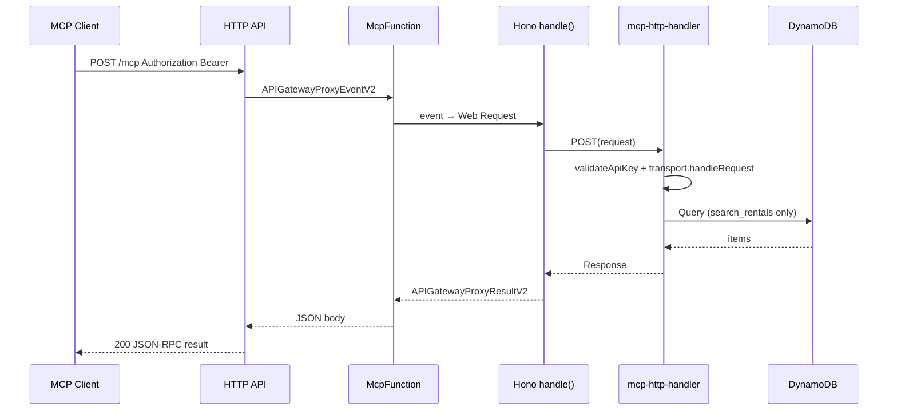

# feat: MCP Lambda deployment via HTTP API

## Summary

Replace the Vercel deployment of `timtro-mcp` with **AWS Lambda behind API Gateway HTTP API**. The existing Web Standard MCP handler stays unchanged; a new Hono-based Lambda entry bridges API Gateway v2 events to `Request`/`Response`. Build with **Vite + SkipBuild** (crawler pattern), deploy via the existing SAM stack (rewritten from IAM-only/Vercel OIDC to Lambda + execution role), and expose MCP at `/mcp`.

---

## Problem Frame

The completed Vercel plan (`2026-05-24-003`) shipped Streamable HTTP MCP with cross-cloud OIDC credentials. That works but adds operational complexity (Vercel + AWS OIDC provider + separate IAM role) and cross-region latency to DynamoDB in `ap-southeast-1`. The user now wants a single AWS-native deployment: Lambda + API Gateway, with Vercel removed entirely.

---

## Requirements

- R1. Remove Vercel deployment artifacts, dependencies, and documentation.
- R2. Deploy MCP as **AWS Lambda** behind **API Gateway HTTP API** at path `/mcp`.
- R3. Bridge API Gateway v2 events to the existing Web Standard handler via **Hono** `handle()` adapter.
- R4. Build Lambda bundle with **Vite SSR + SkipBuild** (match `timtro-crawler` monorepo convention).
- R5. Rewrite `apps/timtro-mcp/template.yaml` from Vercel OIDC IAM-only to Lambda function + HTTP API + DynamoDB read execution role.
- R6. Preserve MCP behavior: stateless Streamable HTTP, Bearer API key auth, `get_areas` + `search_rentals` tools unchanged.
- R7. Preserve local dev via `dev-http-server.ts` (path updated to `/mcp`) and add `sam local start-api` target.
- R8. Update smoke tests, Nx targets, and README for Lambda-only deploy sequence.

---

## Scope Boundaries

- OAuth 2.1 / Cognito JWT authorizer at API Gateway.
- REST API (v1) — HTTP API (v2) chosen after comparison; sufficient for stateless MCP + in-handler Bearer auth.
- Lambda Function URL as primary entry (HTTP API is the chosen surface).
- WAF, rate limiting, API key rotation automation, custom domain / Route53.
- Provisioned concurrency (defer unless cold-start SLO requires it).
- Crawler stack changes beyond using the existing `timtro-rental-info-v2-{env}` table name parameter.

### Deferred to Follow-Up Work

- Custom domain for stable client URL across stack replacements.
- Provisioned concurrency for production cold-start SLO.
- Secrets Manager runtime fetch for `MCP_API_KEY` rotation without redeploy.
- OAuth 2.1 with Cognito JWT authorizer for native MCP client discovery.

---

## Context & Research

### Relevant Code and Patterns

- MCP handler (unchanged core): `apps/timtro-mcp/src/mcp-http-handler.ts` — stateless `WebStandardStreamableHTTPServerTransport`, exports `GET`/`POST`/`DELETE`.
- Auth: `apps/timtro-mcp/src/auth/api-key.ts` — Bearer validation; needs Lambda production detection (remove `VERCEL_ENV`).
- Credentials: `apps/timtro-mcp/src/aws/credentials.ts` — Vercel OIDC path to be removed; Lambda uses default credential chain.
- Local dev adapter: `apps/timtro-mcp/scripts/dev-http-server.ts` — Node HTTP → Web Request dispatch pattern.
- Crawler Vite build: `apps/timtro-crawler/vite.config.ts` — SSR, `noExternal: true`, AWS SDK externals, `SkipBuild: true` in SAM.
- Crawler deploy: `apps/timtro-crawler/project.json` — `build` → `sam deploy` with parameter overrides.
- Infra shape tests: `apps/timtro-mcp/test/infra/template-shape.test.ts` — currently asserts **no** Lambda; must be rewritten.
- Smoke: `scripts/smoke-http.mjs` — transport-agnostic; update default URL to `/mcp`.

### Institutional Learnings

- Prior Vercel plan evaluated Lambda + Function URL as strong alternative; HTTP API chosen for edge auth/CORS/custom-domain path (see `docs/plans/2026-05-24-003`).
- AWS errors must propagate as MCP tool errors, not empty results (`docs/plans/2026-05-24-001`).
- SAM esbuild breaks pnpm workspace deps — use external Vite build + `SkipBuild: true` (crawler precedent).
- HTTP API has a **30 s integration timeout** — compatible with stateless MCP (each JSON-RPC call is one request); same practical limit as Vercel `maxDuration: 30`.

### External References

- [MCP Streamable HTTP spec (2025-06-18)](https://modelcontextprotocol.io/specification/2025-06-18/basic/transports)
- [MCP TypeScript SDK — WebStandardStreamableHTTPServerTransport](https://ts.sdk.modelcontextprotocol.io/v2/classes/_modelcontextprotocol_server.server_streamableHttp.WebStandardStreamableHTTPServerTransport.html)
- [Hono AWS Lambda adapter](https://hono.dev/docs/getting-started/aws-lambda)
- [AWS::Serverless::HttpApi](https://docs.aws.amazon.com/serverless-application-model/latest/developerguide/sam-resource-httpapi.html)
- [HTTP API Lambda proxy integration](https://docs.aws.amazon.com/apigateway/latest/developerguide/http-api-develop-integrations-lambda.html)

---

## Key Technical Decisions

- **HTTP API over REST API:** Lower cost/latency, simpler SAM config, built-in CORS. REST API adds API keys/usage plans at gateway level — not needed because auth stays in Lambda. (User confirmed HTTP API.)
- **Hono `handle()` adapter:** Official MCP SDK documents Hono integration; `handle()` suffices with `enableJsonResponse: true` (buffered JSON, not SSE). Avoid `aws-lambda-web-adapter` (process overhead) and AWS stdio wrapper libraries (wrong abstraction).
- **Keep `mcp-http-handler.ts` unchanged:** Lambda entry is a thin routing layer; MCP server, tools, and repository logic are platform-agnostic.
- **Vite + SkipBuild:** Match crawler monorepo convention; bundles `@timtro/rental-info` workspace dep reliably (SAM built-in esbuild fails on pnpm workspaces).
- **Endpoint path `/mcp`:** MCP spec convention; no Vercel `/api/mcp` alignment needed.
- **Lambda execution role for DynamoDB:** Remove Vercel OIDC IAM role entirely; `DynamoDBReadPolicy` on the auto-created execution role. `resolveAwsClientConfig()` returns `{ region }` only — default SDK chain picks up Lambda role.
- **Production detection:** Extend `isProduction()` to recognize `AWS_LAMBDA_FUNCTION_NAME` or rely on SAM setting `NODE_ENV=production`; remove `VERCEL_ENV` check.
- **Auth at Lambda, not gateway:** Bearer API key validated in handler (existing pattern). API Gateway CORS allows `Authorization` header through; no JWT authorizer.
- **Runtime `nodejs24.x` + `arm64`:** Align with `timtro-crawler`.
- **Lambda timeout 29 s:** HTTP API integration max is 30 s; set Lambda one second below to fail cleanly in Lambda logs before gateway 504.
- **Memory 1024 MB:** Community sweet spot for Node MCP servers (CPU scales with memory); adjust after profiling if needed.

---

## Open Questions

### Resolved During Planning

- **Dual deploy with Vercel?** No — remove Vercel entirely.
- **HTTP API vs REST API?** HTTP API — sufficient for stateless MCP; user confirmed.
- **Adapter library?** Hono `handle()` — user confirmed acceptable.
- **Build tool?** Vite + SkipBuild + Vitest — user confirmed.
- **Does 30 s timeout affect MCP?** No for current tools — each JSON-RPC message is one HTTP request; `get_areas` and `search_rentals` complete well under 30 s.

### Deferred to Implementation

- Exact Hono route registration shape (single `app.all('/mcp', …)` vs method-specific handlers).
- Whether to add `@types/aws-lambda` as devDependency for handler typing.
- Stack rename from `timtro-mcp-iam-*` to `timtro-mcp-*` in `samconfig.toml` (recommended during implementation to reflect compute stack; document manual deletion of old IAM-only stacks).

---

## High-Level Technical Design

> *This illustrates the intended approach and is directional guidance for review, not implementation specification. The implementing agent should treat it as context, not code to reproduce.*

---

## Output Structure

    apps/timtro-mcp/
    ├── src/
    │   └── lambda-handler.ts          # new — Hono app + handle() export
    ├── dist/
    │   └── lambda.mjs                 # Vite SSR output (gitignored)
    ├── vite.config.ts                 # new — Lambda entry build
    ├── template.yaml                    # rewrite — HttpApi + Function
    ├── env.example.json                 # update — drop Vercel params, add McpApiKey
    ├── env.local.json                   # new — sam local env (gitignored)
    └── test/
        ├── lambda-handler.test.ts       # new
        └── infra/template-shape.test.ts # rewrite

    Removed:
    ├── vercel.json
    ├── scripts/build-vercel-api.mts
    ├── api/mcp.js
    └── @vercel/oidc-aws-credentials-provider dependency

---

## Implementation Units

- U1. **Hono Lambda handler entry**

**Goal:** Add a Lambda entry point that routes API Gateway v2 events to the existing Web Standard MCP handlers.

**Requirements:** R2, R3, R6

**Dependencies:** None

**Files:**
- Create: `apps/timtro-mcp/src/lambda-handler.ts`
- Modify: `apps/timtro-mcp/package.json` (add `hono` runtime dep; add `@types/aws-lambda` devDep if used)
- Test: `apps/timtro-mcp/test/lambda-handler.test.ts`

**Approach:**
- Create a Hono app with routes for `GET`, `POST`, `DELETE` on `/mcp` (and optionally `$default` catch-all if API Gateway stage path differs).
- Each route delegates to the corresponding export from `mcp-http-handler.ts` via `c.req.raw`.
- Export `handler = handle(app)` from `hono/aws-lambda`.
- Use `handle()` (not `streamHandle()`) because `enableJsonResponse: true` returns buffered JSON.

**Patterns to follow:**
- MCP SDK Hono example referenced in `WebStandardStreamableHTTPServerTransport` docs.
- Dispatch pattern in `apps/timtro-mcp/scripts/dev-http-server.ts`.

**Test scenarios:**
- Happy path: mock `APIGatewayProxyEventV2` POST with valid Bearer → handler returns 200 with JSON body shape from MCP transport (mock or spy on underlying handler).
- Happy path: GET and DELETE methods route to correct handler exports.
- Edge case: request to `/mcp` without Authorization → 401 before MCP processing.
- Error path: underlying handler throws → 500 or propagated status (match dev-http-server behavior).
- Integration: event headers (`Authorization`, `Content-Type`, `Accept`) appear on the Web `Request` passed to MCP handler.

**Verification:**
- Unit tests pass without AWS credentials.
- Handler export is compatible with `index.handler` or `lambda.handler` SAM Handler string (match Vite output filename).

---

- U2. **Vite Lambda build pipeline**

**Goal:** Bundle the Lambda handler and all workspace dependencies into `dist/lambda.mjs` for SAM deployment.

**Requirements:** R4

**Dependencies:** U1

**Files:**
- Create: `apps/timtro-mcp/vite.config.ts`
- Modify: `apps/timtro-mcp/package.json` (add `vite` devDep; remove `esbuild` if no longer used)
- Modify: `apps/timtro-mcp/.gitignore` (ignore `dist/`)
- Modify: `apps/timtro-mcp/project.json` (add `build` target)
- Test: `apps/timtro-mcp/test/infra/template-shape.test.ts` (assert `CodeUri: dist/` and `SkipBuild: true`)

**Approach:**
- Vite SSR build with entry `src/lambda-handler.ts`, output `dist/lambda.mjs`.
- `ssr.noExternal: true` to bundle `@timtro/rental-info` workspace package.
- Externalize `@aws-sdk/client-dynamodb` and `@aws-sdk/lib-dynamodb` (provided by Lambda runtime).
- Target `node24`, minify, no code splitting.
- Nx `build` target: `vite build` in project root; `deploy` depends on `build`.

**Patterns to follow:**
- `apps/timtro-crawler/vite.config.ts`

**Test scenarios:**
- Test expectation: none — build verification is outcome-based (see Verification).

**Verification:**
- `pnpm nx build timtro-mcp` produces `dist/lambda.mjs` that exports `handler`.
- Bundle includes MCP SDK and `@timtro/rental-info`; AWS SDK is external.

---

- U3. **SAM template — HTTP API + Lambda**

**Goal:** Replace the Vercel OIDC IAM-only template with a full Lambda + HTTP API stack.

**Requirements:** R2, R5

**Dependencies:** U2

**Files:**
- Modify: `apps/timtro-mcp/template.yaml`
- Modify: `apps/timtro-mcp/samconfig.toml` (optional stack rename; update if desired)
- Modify: `apps/timtro-mcp/env.example.json`
- Test: `apps/timtro-mcp/test/infra/template-shape.test.ts`

**Approach:**
- Remove `McpDynamoDbReadRole` (Vercel OIDC) and Vercel parameters (`VercelTeamSlug`, `VercelProjectName`).
- Add parameters: `EnvironmentName`, `RentalInfoTableName`, `McpApiKey` (`NoEcho: true`).
- Add `AWS::Serverless::HttpApi` with CORS allowing `Authorization`, `Content-Type`, `Accept`, `Mcp-Session-Id`, `MCP-Protocol-Version`; methods GET/POST/DELETE/OPTIONS.
- Add `AWS::Serverless::Function` (`McpFunction`):
  - `Handler: lambda.handler`, `CodeUri: dist/`, `Metadata.SkipBuild: true`
  - `Runtime: nodejs24.x`, `Architectures: [arm64]`, `Timeout: 29`, `MemorySize: 1024`
  - Env: `RENTAL_INFO_TABLE_NAME`, `MCP_API_KEY`, `NODE_ENV: production`, `AWS_REGION` implicit
  - Events: HttpApi GET/POST/DELETE on `/mcp`, `PayloadFormatVersion: "2.0"`
  - Policies: `DynamoDBReadPolicy` on resolved table name
- Add `AWS::Logs::LogGroup` with retention.
- Outputs: `McpApiUrl` (`https://{api-id}.execute-api.{region}.amazonaws.com/mcp`), `McpFunctionArn`.

**Patterns to follow:**
- Crawler function resource shape in `apps/timtro-crawler/template.yaml`
- Existing table name resolution conditional in current `template.yaml`

**Test scenarios:**
- Happy path: template contains `McpHttpApi`, `McpFunction`, `Type: HttpApi` events on `/mcp`.
- Happy path: template does **not** contain Vercel OIDC trust policy or `McpDynamoDbReadRole`.
- Happy path: `DynamoDBReadPolicy` references `timtro-rental-info-v2-${EnvironmentName}` default.
- Edge case: `McpApiKey` parameter has `NoEcho: true`.
- Edge case: template does not create DynamoDB tables (table owned by crawler stack).

**Verification:**
- `pnpm nx sam:validate timtro-mcp` passes with `--lint`.
- All infra shape tests pass.

---

- U4. **Remove Vercel deployment**

**Goal:** Delete all Vercel-specific artifacts, dependencies, and credential paths.

**Requirements:** R1, R6

**Dependencies:** U3 (SAM must provide compute before removing Vercel)

**Files:**
- Delete: `apps/timtro-mcp/vercel.json`, `apps/timtro-mcp/scripts/build-vercel-api.mts`, `apps/timtro-mcp/api/mcp.js`
- Modify: `apps/timtro-mcp/package.json` (remove `@vercel/oidc-aws-credentials-provider`, `esbuild`)
- Modify: `apps/timtro-mcp/src/aws/credentials.ts` (remove OIDC import and `AWS_ROLE_ARN` branch)
- Modify: `apps/timtro-mcp/src/auth/api-key.ts` (remove `VERCEL_ENV`; add `AWS_LAMBDA_FUNCTION_NAME` to production check)
- Modify: `apps/timtro-mcp/project.json` (remove `build:vercel` target)
- Modify: `package.json` (remove `vercel` devDep; fix `mcp:deploy:iam` → `mcp:deploy` pointing to `nx deploy timtro-mcp`)
- Modify: `apps/timtro-mcp/test/aws-credentials.test.ts` (remove OIDC mock tests; test region-only config)
- Modify: `apps/timtro-mcp/test/api-key.test.ts` (add Lambda production detection case)

**Approach:**
- `resolveAwsClientConfig()` returns `{ region: resolveAwsRegion() }` only.
- `isProduction()` true when `NODE_ENV === 'production'` OR `AWS_LAMBDA_FUNCTION_NAME` is set.
- Remove `.vercel` from gitignore if present; remove `api/mcp.js` from gitignore entry if only Vercel artifact.

**Test scenarios:**
- Happy path: `resolveAwsClientConfig()` returns region only, no credentials key.
- Happy path: unset `MCP_API_KEY` + `AWS_LAMBDA_FUNCTION_NAME=timtro-mcp-dev` → 401 (not dev bypass).
- Happy path: unset `MCP_API_KEY` + no Lambda env → dev bypass (local dev preserved).
- Error path: remove `@vercel/oidc-aws-credentials-provider` — no remaining imports in codebase.

**Verification:**
- Grep confirms no `vercel`, `@vercel/oidc`, or `build-vercel-api` references remain (except historical plan docs).
- All unit tests pass.

---

- U5. **Dev, deploy, and smoke wiring**

**Goal:** Update local dev path, Nx targets, env files, and smoke script for Lambda-only workflow.

**Requirements:** R7, R8

**Dependencies:** U3, U4

**Files:**
- Modify: `apps/timtro-mcp/scripts/dev-http-server.ts` (path `/mcp`, log message)
- Modify: `apps/timtro-mcp/project.json` (update `deploy` dependsOn `build`; add `sam:local` target; update `inspector:local` URL; remove `inspector:dev` Vercel URL or repoint to deployed API GW URL from env)
- Create: `apps/timtro-mcp/env.local.json` (example for sam local — document in README, gitignore)
- Modify: `apps/timtro-mcp/env.example.json` (McpApiKey, drop Vercel params)
- Modify: `scripts/smoke-http.mjs` (default `MCP_URL` → `http://localhost:3000/mcp`)
- Modify: `apps/timtro-mcp/README.md` (Lambda deploy sequence, client config, env table)
- Modify: `package.json` root scripts

**Approach:**
- `deploy` target: `dependsOn: ["test", "build"]` then `sam deploy` with parameter overrides from `env.dev.json`.
- `sam:local` target: `sam local start-api --env-vars env.local.json` (port 3000).
- Smoke against deployed stack: `MCP_URL=https://{api-id}.execute-api.ap-southeast-1.amazonaws.com/mcp MCP_API_KEY=... pnpm smoke`.
- Document deploy sequence: crawler table → `pnpm nx build timtro-mcp` → `pnpm nx deploy timtro-mcp`.

**Test scenarios:**
- Test expectation: none for wiring — manual/smoke verification (see Verification).

**Verification:**
- `pnpm dev` serves `/mcp`; `pnpm smoke` passes locally.
- README documents full deploy sequence without Vercel references.

---

- U6. **End-to-end verification**

**Goal:** Confirm deployed Lambda endpoint serves MCP correctly.

**Requirements:** R6, R8

**Dependencies:** U1–U5

**Files:**
- Modify: `apps/timtro-mcp/test/infra/template-shape.test.ts` (final assertions)
- No new test files unless gaps found during implementation

**Approach:**
- Run smoke script against `sam local start-api` with `env.local.json` (requires AWS creds for search_rentals or `SKIP_SEARCH_RENTALS=1`).
- Post-deploy smoke against API Gateway URL (manual or CI step).

**Test scenarios:**
- Integration: initialize → tools/list → get_areas over HTTP API (local or deployed).
- Integration: search_rentals with valid city/district returns results when AWS configured.
- Integration: missing Bearer on deployed endpoint → 401.
- Integration: OPTIONS preflight to `/mcp` returns CORS headers including `Authorization` in `Access-Control-Allow-Headers`.

**Verification:**
- Smoke script completes initialize + get_areas (+ search_rentals when AWS available) against `/mcp`.

---

## System-Wide Impact

- **Interaction graph:** MCP clients → HTTP API → Lambda → `mcp-http-handler` → `RentalInfoRepository` → DynamoDB. Crawler stack unchanged; reads same v2 table.
- **Error propagation:** Auth failures → HTTP 401 at Lambda (before MCP). DynamoDB errors → MCP tool errors (unchanged). API Gateway timeout → 504 to client.
- **State lifecycle risks:** Stateless transport — no session state across requests. Module-level singletons (`server`, `transport`, `documentClient`) reused on warm Lambda containers.
- **API surface parity:** Vercel `/api/mcp` URL deprecated; clients must update to API Gateway `/mcp` URL.
- **Integration coverage:** Unit tests cover adapter and auth; smoke script covers full MCP handshake; CORS preflight requires HTTP API or manual curl test.
- **Unchanged invariants:** MCP tool schemas, DynamoDB query logic, `@timtro/rental-info` shared lib, crawler table schema and naming convention.

---

## Risks & Dependencies

| Risk | Mitigation |
|------|------------|
| pnpm workspace bundling fails in Vite | Follow crawler `noExternal: true` pattern; verify `dist/lambda.mjs` imports resolve |
| Cold start latency on first MCP initialize | Accept for dev; document; defer provisioned concurrency |
| HTTP API 30 s timeout on slow queries | Current tools complete in seconds; monitor if multi-district queries grow |
| Stack rename orphans old IAM stack | Document manual deletion of `timtro-mcp-iam-*` stacks after migration |
| Clients still configured with Vercel URL | README + explicit URL change in deploy output |
| `MCP_API_KEY` in CloudFormation parameter | `NoEcho: true`; document rotation requires redeploy (Secrets Manager deferred) |

---

## Documentation / Operational Notes

- Update `apps/timtro-mcp/README.md` with: build → deploy → smoke sequence, API Gateway URL from stack output, Cursor MCP client config, local dev (`pnpm dev`) and `sam local` instructions.
- Remove Vercel OIDC one-time setup section from README.
- Stack output `McpApiUrl` is the canonical client endpoint until custom domain is added.
- Deploy prerequisite: crawler stack with `timtro-rental-info-v2-{env}` table must exist.
- Region: `ap-southeast-1` (unchanged).

---

## Sources & References

- **Prior plan:** [docs/plans/2026-05-24-003-feat-mcp-streamable-http-vercel-plan.md](docs/plans/2026-05-24-003-feat-mcp-streamable-http-vercel-plan.md)
- Related code: `apps/timtro-mcp/src/mcp-http-handler.ts`, `apps/timtro-crawler/vite.config.ts`, `apps/timtro-crawler/template.yaml`
- External: [Hono AWS Lambda](https://hono.dev/docs/getting-started/aws-lambda), [SAM HttpApi](https://docs.aws.amazon.com/serverless-application-model/latest/developerguide/sam-resource-httpapi.html)
