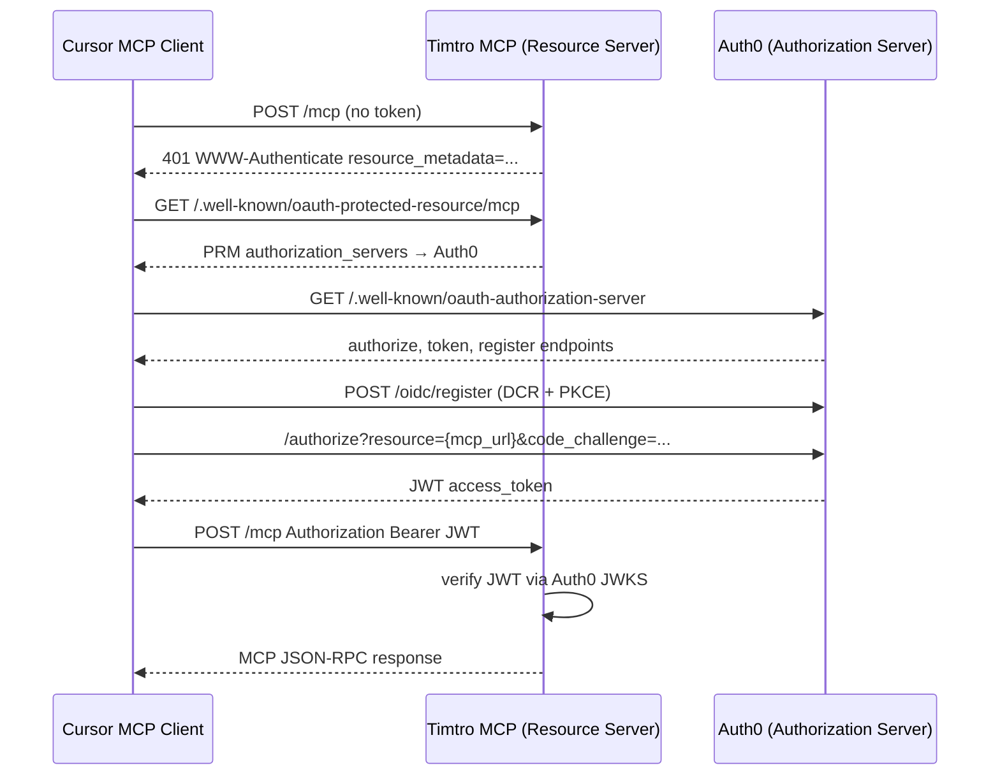

# feat: MCP OAuth 2.1 with Auth0

## Summary

Add **MCP-spec OAuth 2.1** (Auth0) to `apps/timtro-mcp` while **keeping static `MCP_API_KEY` Bearer auth permanently**. The Lambda resource server exposes RFC 9728 Protected Resource Metadata, returns spec-compliant `401` + `WWW-Authenticate` challenges, validates Auth0 JWT access tokens in-handler, and continues to accept the shared API key for scripts, CI/smoke, and manual client configs. Cursor users connect via OAuth discovery; operators retain API-key access without a browser flow.

---

## Problem Frame

The MCP server deployed on Lambda + HTTP API authenticates requests with a shared static API key (`src/auth/api-key.ts`). That works for manual Cursor config but does not support the MCP Authorization profile: clients cannot discover the authorization server, run PKCE, or obtain tokens on behalf of users. Prior plans explicitly deferred OAuth in favor of shipping Lambda first. The user now wants OAuth with **Auth0** (not AWS Cognito).

---

## Requirements

- R1. **Auth0 as Authorization Server** — login, consent, token issuance, DCR, and JWKS hosted by Auth0; Lambda acts only as the OAuth 2.1 resource server.
- R2. **MCP Authorization spec compliance** — RFC 9728 Protected Resource Metadata, RFC 8414 discovery via Auth0, PKCE (client-side), RFC 8707 `resource` parameter alignment, Bearer token on every `/mcp` request.
- R3. **Spec-compliant unauthenticated responses** — missing/invalid tokens return HTTP 401 with `WWW-Authenticate` including `resource_metadata` URL (not a plain `Unauthorized` body).
- R4. **JWT validation in Lambda** — verify RS256 signature (JWKS), `iss`, `aud`, `exp`; construct MCP `AuthInfo` for `transport.handleRequest`.
- R5. **Cursor compatibility** — support DCR flow (`cursor://anysphere.cursor-mcp/oauth/callback`) and document static `CLIENT_ID` fallback in `mcp.json`.
- R6. **Preserve MCP tool behavior** — `get_areas` and `search_rentals` unchanged; auth is HTTP-boundary only.
- R7. **Local dev ergonomics** — dev bypass when OAuth env is unset (mirror today's non-production API-key bypass pattern).
- R8. **Deploy via SAM** — new env parameters for Auth0 domain, audience, canonical MCP URL; route well-known metadata paths through API Gateway.
- R9. **Permanent dual-auth** — production accepts **either** a valid Auth0 JWT **or** a valid `MCP_API_KEY` Bearer token on the same `/mcp` endpoint; both paths produce `AuthInfo` and reach MCP tools unchanged.

**Origin actors:** MCP client user (Cursor), MCP client (Cursor), Auth0 (AS), Timtro MCP Lambda (RS), operator/script (API key)

**Origin flows:** F1 — Cursor discovers auth via 401/PRM and completes OAuth; F2 — authenticated MCP JSON-RPC on `/mcp`; F3 — script/smoke calls `/mcp` with static API key Bearer

**Origin acceptance examples:** AE1 — Cursor user adds MCP URL only, completes browser login, calls `get_areas`; AE2 — invalid/expired token returns 401 with discovery headers; AE3 — smoke script with `MCP_API_KEY` calls `get_areas` while OAuth is enabled in production

---

## Scope Boundaries

- Building a custom OAuth authorization server (Auth0 hosts `/authorize`, `/token`, DCR).
- User signup/billing UI beyond Auth0 hosted login.
- Per-user rental data isolation or per-user DynamoDB scoping (shared read-only data remains).
- API Gateway JWT authorizer (auth stays in Lambda, consistent with current architecture).
- WAF, rate limiting, Secrets Manager rotation automation.
- Client ID Metadata Documents (CIMD) as primary registration — DCR is sufficient for v1; CIMD is optional follow-up when Cursor support matures.

### Deferred to Follow-Up Work

- **Custom domain for stable MCP resource URI** — strongly recommended before production OAuth (Auth0 API identifier must match canonical MCP URL; execute-api URLs change on stack replacement). v1 may use current `McpApiUrl` output with documented rotation procedure.
- **Per-tool scope enforcement** — Auth0 scopes defined in v1; enforcing `tool:get_areas` vs `tool:search_rentals` at handler level deferred unless needed.
- **Removing API key auth** — dual-auth is permanent; no planned cutover to OAuth-only.
- **MCP Inspector OAuth E2E in CI** — manual verification first.

---

## Context & Research

### Relevant Code and Patterns

- Auth boundary: `apps/timtro-mcp/src/auth/api-key.ts` → swappable verifier module
- HTTP handler: `apps/timtro-mcp/src/mcp-http-handler.ts` — calls validator, passes `{ authInfo }` to `WebStandardStreamableHTTPServerTransport.handleRequest`
- Lambda routing: `apps/timtro-mcp/src/lambda-handler.ts` — Hono `GET/POST/DELETE /mcp` only today
- SAM: `apps/timtro-mcp/template.yaml` — `McpApiKey` param, CORS allows `Authorization`
- Deploy params: `apps/timtro-mcp/env.example.json`, `scripts/format-sam-parameter-overrides.mjs`
- Tests: `apps/timtro-mcp/test/api-key.test.ts`, `test/lambda-handler.test.ts`, `test/infra/template-shape.test.ts`
- Smoke: `scripts/smoke-http.mjs`
- MCP SDK exports `AuthInfo`, `OAuthProtectedResourceMetadata`, `resourceUrlFromServerUrl`, `checkResourceAllowed` — no built-in JWT middleware in `@modelcontextprotocol/server@2.0.0-alpha.2`

### Institutional Learnings

- Prior Lambda plan (`docs/plans/2026-05-24-004`) deferred Cognito JWT; auth-at-handler pattern is established.
- Prior Vercel plan (`docs/plans/2026-05-24-003`) reserved `auth/` module for verifier swap and RFC 9728 metadata.
- Remove debug `console.log` of authorization headers in `api-key.ts` before OAuth rollout (security).

### External References

- [MCP Authorization spec (2025-06-18)](https://modelcontextprotocol.io/specification/2025-06-18/basic/authorization)
- [Auth0 — Authorization for Your MCP Server](https://auth0.com/ai/docs/mcp/get-started/authorization-for-your-mcp-server)
- [Auth0 — Resource Parameter Compatibility Profile](https://auth0.com/ai/docs/mcp/guides/resource-param-compatibility-profile)
- [Auth0 hono-mcp-js sample](https://github.com/auth0-samples/auth0-ai-samples/tree/main/auth-for-mcp/hono-mcp-js)
- [Cursor MCP docs — OAuth redirect URI](https://cursor.com/docs/mcp)
- RFCs: [8414](https://datatracker.ietf.org/doc/html/rfc8414), [9728](https://datatracker.ietf.org/doc/html/rfc9728), [8707](https://datatracker.ietf.org/doc/html/rfc8707), [7591](https://datatracker.ietf.org/doc/html/rfc7591)

---

## Key Technical Decisions

- **Auth0 over Cognito** — user choice; Auth0 provides MCP-oriented docs, DCR, Resource Parameter Compatibility Profile, and reference Hono sample. No AWS lock-in for identity; fits existing in-handler JWT validation pattern.
- **In-handler JWT validation, not API Gateway authorizer** — MCP requires custom `401` + `WWW-Authenticate` with `resource_metadata`; gateway JWT authorizers cannot emit MCP discovery challenges. Matches current API-key-at-handler architecture.
- **`@auth0/auth0-api-js` for JWT verify** — official Auth0 library with JWKS caching; module-scoped `ApiClient` survives Lambda warm starts. Alternative `jose` acceptable if dependency minimization preferred.
- **Auth0 API identifier = canonical MCP resource URI** — e.g. `https://{api-id}.execute-api.ap-southeast-1.amazonaws.com/mcp` (or custom domain). Must equal RFC 8707 `resource` param and JWT `aud`. Enable **Resource Parameter Compatibility Profile** in Auth0 tenant.
- **Protected Resource Metadata on Lambda** — serve `GET /.well-known/oauth-protected-resource/mcp` (primary for `/mcp` path) and `GET /.well-known/oauth-protected-resource` (fallback). PRM points `authorization_servers` to Auth0 issuer URL.
- **Auth0 DCR with default third-party API permissions** — Cursor auto-registers; without default grants on the Timtro MCP API, tokens will lack audience/scopes (silent failure mode).
- **Permanent dual-auth** — accept valid Auth0 JWT **or** valid `MCP_API_KEY` on every environment where each credential is configured. OAuth for human MCP clients (Cursor); API key for scripts, smoke/CI, and manual `headers` config. Not a migration phase — both remain supported.
- **Token resolution order** — parse Bearer token once; if JWT-shaped (three dot-separated segments), try Auth0 verify first; on failure or non-JWT shape, try API key constant-time compare when `MCP_API_KEY` is set. Avoid treating a JWT-looking string as an API key literal.
- **401 semantics with dual-auth** — return OAuth discovery challenge only when **both** paths fail (no token, invalid JWT, and invalid/missing API key). Valid API key must not trigger OAuth discovery flow.
- **Scope model** — define Auth0 API scopes `tool:get_areas`, `tool:search_rentals` (or coarse `mcp:tools`); enforcement deferred unless RBAC needed. API key auth retains full tool access (same as today).

---

## Open Questions

### Resolved During Planning

- **IdP choice?** Auth0 (user confirmed; not Cognito).
- **Gateway vs in-handler auth?** In-handler JWT validation.
- **Replace or coexist with API key?** Permanent coexistence — user confirmed dual-auth is intentional, not transitional.

### Deferred to Implementation

- Exact Auth0 tenant region/domain (`*.auth0.com` vs custom Auth0 domain).
- Whether to add `@auth0/auth0-api-js` vs `jose` after checking bundle size impact on Vite Lambda bundle.
- Exact PRM path priority if API Gateway stage prefix affects well-known URLs.

---

## High-Level Technical Design

> *This illustrates the intended approach and is directional guidance for review, not implementation specification. The implementing agent should treat it as context, not code to reproduce.*

**Component responsibilities:**

| Layer | Responsibility |
|-------|----------------|
| Auth0 tenant | AS metadata, DCR, login/consent, token issuance, JWKS |
| `auth/protected-resource-metadata.ts` | Build PRM JSON; build `WWW-Authenticate` challenge |
| `auth/access-token.ts` | Parse Bearer header; verify JWT; return `AuthInfo` |
| `auth/resolve-auth.ts` | Orchestrate: JWT verify first, then API key fallback; permanent dual-auth |
| `mcp-http-handler.ts` | Call resolver; 401 with challenge or forward to transport |
| `lambda-handler.ts` | Route well-known paths + existing `/mcp` methods |

---

## Output Structure

    apps/timtro-mcp/src/auth/
      access-token.ts          (new — JWT verify via Auth0)
      protected-resource-metadata.ts  (new — RFC 9728)
      resolve-auth.ts          (new — permanent JWT + API key dual-auth)
      api-key.ts               (modify — remove debug logs; first-class verifier in resolver)

---

## Implementation Units

- U1. **Auth0 tenant and API configuration**

**Goal:** Auth0 authorization server ready to issue MCP-compliant access tokens.

**Requirements:** R1, R5

**Dependencies:** None (manual Dashboard/CLI; document in README)

**Files:**
- Modify: `apps/timtro-mcp/README.md`

**Approach:**
- Enable tenant toggles: Resource Parameter Compatibility Profile, Dynamic Client Registration, scope descriptions for consent.
- Create Auth0 API (resource server) with **HTTPS URI identifier** matching canonical MCP URL (stack output `McpApiUrl` or planned custom domain).
- Configure scopes: `tool:get_areas`, `tool:search_rentals` (or `mcp:tools`).
- Set **Default Permissions for Third-Party Apps** on the API (mandatory for DCR clients).
- Promote login connection(s) to domain-level (required for DCR third-party apps).
- Optionally pre-register Native/SPA app with callback `cursor://anysphere.cursor-mcp/oauth/callback` for static OAuth fallback.

**Patterns to follow:**
- [Auth0 MCP get-started guide](https://auth0.com/ai/docs/mcp/get-started/authorization-for-your-mcp-server)
- [Auth0 hono-mcp-js sample](https://github.com/auth0-samples/auth0-ai-samples/tree/main/auth-for-mcp/hono-mcp-js)

**Test scenarios:**
- Test expectation: none — manual Auth0 Dashboard/CLI verification; document checklist in README

**Verification:**
- Auth0 API exists with URI identifier = MCP resource URL
- Resource Parameter Compatibility Profile enabled
- DCR enabled; default third-party permissions grant MCP API scopes
- Test token from Auth0 dashboard or SPA app includes correct `aud` claim

---

- U2. **Protected Resource Metadata and 401 challenges**

**Goal:** MCP clients can discover Auth0 via RFC 9728 metadata and `WWW-Authenticate` on 401.

**Requirements:** R2, R3

**Dependencies:** U1 (Auth0 issuer URL and scopes known)

**Files:**
- Create: `apps/timtro-mcp/src/auth/protected-resource-metadata.ts`
- Create: `apps/timtro-mcp/test/protected-resource-metadata.test.ts`
- Modify: `apps/timtro-mcp/src/lambda-handler.ts`
- Modify: `apps/timtro-mcp/scripts/dev-http-server.ts`
- Modify: `apps/timtro-mcp/template.yaml`

**Approach:**
- Build PRM document: `resource` (canonical MCP URI), `authorization_servers` (Auth0 issuer with trailing slash), `scopes_supported`, `bearer_methods_supported`, optional `jwks_uri`.
- Use MCP SDK `resourceUrlFromServerUrl` or env `MCP_SERVER_URL` for canonical URI consistency.
- Expose `GET /.well-known/oauth-protected-resource/mcp` and `GET /.well-known/oauth-protected-resource`.
- Implement `buildUnauthorizedResponse()` returning 401 JSON body + `WWW-Authenticate: Bearer resource_metadata="...", scope="..."`.
- Add API Gateway HttpApi events for well-known paths in SAM template.
- Mirror routes in dev HTTP server.

**Patterns to follow:**
- MCP SDK type `OAuthProtectedResourceMetadata`
- Auth0 sample `auth0.ts` PRM builder

**Test scenarios:**
- Happy path: GET `/.well-known/oauth-protected-resource/mcp` → 200 JSON with `authorization_servers` containing Auth0 domain
- Happy path: GET `/.well-known/oauth-protected-resource` → same or equivalent metadata
- Edge case: `MCP_SERVER_URL` without trailing slash — `resource` field consistent with RFC 8707 guidance
- Edge case: missing env vars → PRM returns sensible error or fails fast at startup (implementation choice)

**Verification:**
- PRM JSON validates against MCP spec fields
- 401 response includes parseable `WWW-Authenticate` with `resource_metadata` URL

---

- U3. **Auth0 JWT access token verifier**

**Goal:** Validate Bearer JWTs from Auth0 and produce MCP `AuthInfo`.

**Requirements:** R4

**Dependencies:** U1

**Files:**
- Create: `apps/timtro-mcp/src/auth/access-token.ts`
- Create: `apps/timtro-mcp/test/access-token.test.ts`
- Modify: `apps/timtro-mcp/package.json` (add `@auth0/auth0-api-js` or `jose`)

**Approach:**
- Module-scoped Auth0 `ApiClient` with `domain` + `audience` from env (`AUTH0_DOMAIN`, `AUTH0_AUDIENCE`).
- Parse `Authorization: Bearer` header; reject missing/malformed.
- Verify JWT: signature (JWKS), `iss`, `aud`, `exp`.
- Map claims to `AuthInfo`: `token`, `clientId` from `azp`/`client_id`, `scopes` from `scope` or `permissions`, optional `expiresAt`.
- Do not log tokens or Authorization headers.

**Execution note:** Add unit tests with mocked JWKS or pre-signed test tokens before wiring into handler.

**Patterns to follow:**
- Current `api-key.ts` return shape for `AuthInfo`
- Auth0 hono-mcp-js `verifyAccessToken` pattern

**Test scenarios:**
- Happy path: valid JWT with matching `aud` → `AuthInfo` with expected `clientId` and scopes
- Error path: expired token → undefined or throws (caller maps to 401)
- Error path: wrong `aud` → rejected
- Error path: wrong `iss` → rejected
- Error path: missing Bearer header → undefined
- Error path: malformed Authorization scheme → undefined
- Edge case: `aud` as array containing expected audience → accepted

**Verification:**
- All verifier unit tests pass without network (mock JWKS or fixture tokens)

---

- U4. **Auth resolver and MCP handler integration**

**Goal:** Wire permanent dual-auth into `/mcp`: Auth0 JWT **and** `MCP_API_KEY`, with spec-compliant 401 only when both fail.

**Requirements:** R2, R3, R4, R7, R9

**Dependencies:** U2, U3

**Files:**
- Create: `apps/timtro-mcp/src/auth/resolve-auth.ts`
- Modify: `apps/timtro-mcp/src/mcp-http-handler.ts`
- Modify: `apps/timtro-mcp/src/auth/api-key.ts` (remove debug logs)
- Modify: `apps/timtro-mcp/test/api-key.test.ts` (unchanged behavior)
- Create: `apps/timtro-mcp/test/resolve-auth.test.ts`
- Modify: `apps/timtro-mcp/test/lambda-handler.test.ts`

**Approach:**
- `resolveAuth(request)`: when Auth0 env configured, try JWT verify for JWT-shaped Bearer tokens; on failure or non-JWT token, call `validateApiKey` if `MCP_API_KEY` is set.
- When Auth0 is not configured, use API key only (existing production behavior).
- Return 401 via `buildUnauthorizedResponse()` only when **all configured** auth methods fail (include OAuth discovery headers so Cursor can still initiate OAuth when no credentials supplied).
- When either path succeeds → `transport.handleRequest(request, { authInfo })` unchanged. API key `AuthInfo` keeps `clientId: 'api-key'` for log distinction.
- Dev bypass: when neither Auth0 nor `MCP_API_KEY` configured in non-production → dev `AuthInfo` (existing pattern).

**Patterns to follow:**
- `apps/timtro-mcp/src/mcp-http-handler.ts` current flow

**Test scenarios:**
- Covers AE2. Error path: no Authorization on `/mcp` with Auth0 configured → 401 with `WWW-Authenticate` header
- Happy path: valid JWT → MCP handler invoked with `authInfo`
- Covers AE3. Happy path: valid API key works in production when Auth0 is also configured
- Happy path: invalid JWT + valid API key on same request → API key path succeeds (JWT fails first, then key)
- Error path: invalid JWT + wrong API key → 401 with `WWW-Authenticate`
- Happy path: dev bypass when OAuth unset and non-production
- Integration: `lambda-handler` forwards Authorization header to Web Request (existing test extended)

**Verification:**
- `/mcp` returns discovery-friendly 401 when unauthenticated under Auth0 config
- Authenticated MCP initialize succeeds with valid JWT **and** with valid API key (dual-auth)

---

- U5. **SAM deploy parameters and environment wiring**

**Goal:** Deploy OAuth configuration to Lambda via SAM without secrets in code.

**Requirements:** R8

**Dependencies:** U2, U3, U4

**Files:**
- Modify: `apps/timtro-mcp/template.yaml`
- Modify: `apps/timtro-mcp/env.example.json`
- Modify: `apps/timtro-mcp/scripts/format-sam-parameter-overrides.mjs`
- Modify: `apps/timtro-mcp/test/infra/template-shape.test.ts`

**Approach:**
- Add parameters: `Auth0Domain`, `McpServerUrl` (canonical resource URI), `Auth0Audience` (typically same as `McpServerUrl`).
- Lambda env: `AUTH0_DOMAIN`, `AUTH0_AUDIENCE`, `MCP_SERVER_URL`.
- Keep `McpApiKey` as a **first-class** SAM parameter for permanent dual-auth (deploy alongside Auth0 params).
- Add HttpApi routes for `/.well-known/oauth-protected-resource` and `/.well-known/oauth-protected-resource/mcp`.
- Extend parameter override script whitelist.

**Test scenarios:**
- Happy path: template contains new env vars and well-known routes
- Edge case: `McpApiKey` remains `NoEcho` when still present
- Test expectation: none for deploy itself — manual `sam deploy` verification

**Verification:**
- `pnpm nx sam:validate timtro-mcp` passes
- `template-shape.test.ts` asserts new parameters and routes

---

- U6. **Smoke tests, README, and Cursor client docs**

**Goal:** Operators and users can configure Auth0, deploy, and connect Cursor via OAuth.

**Requirements:** R5, R1

**Dependencies:** U1–U5

**Files:**
- Modify: `apps/timtro-mcp/README.md`
- Modify: `scripts/smoke-http.mjs`
- Modify: `apps/timtro-mcp/env.example.json`

**Approach:**
- Document Auth0 setup checklist (U1), env vars, deploy sequence.
- Document **two supported client configs** permanently:
  - **OAuth (Cursor):** URL only; DCR or static `auth.CLIENT_ID` fallback.
  - **API key (scripts/CI):** `{ "url": "…/mcp", "headers": { "Authorization": "Bearer <MCP_API_KEY>" } }`.
- Smoke script: keep `MCP_API_KEY` as primary smoke path; optionally support `MCP_ACCESS_TOKEN` for JWT smoke.
- Document security posture: API key is shared-secret ops access; rotate via stack redeploy; do not commit keys.
- Document token debugging: `aud` mismatch, Resource Parameter Profile, DCR permissions.
- Document Cursor known issues: click "Needs authentication", clear MCP tokens command.

**Test scenarios:**
- Test expectation: none — manual Cursor OAuth verification (AE1)
- Happy path: smoke with bearer JWT against deployed `/mcp` succeeds for `get_areas`

**Verification:**
- README enables a new operator to complete Auth0 + deploy + Cursor connect without reading the plan
- Smoke script runs against local or deployed endpoint with JWT

---

## System-Wide Impact

- **Interaction graph:** Only HTTP entry layer changes (`lambda-handler`, `mcp-http-handler`, `auth/*`). MCP tools, DynamoDB repository, and AWS credential chain unchanged.
- **Error propagation:** Auth failures stop before MCP transport; must not leak stack traces or token values in 401 responses.
- **State lifecycle risks:** JWKS cache in warm Lambda — acceptable; cold start fetches JWKS once. No server-side session state (stateless MCP preserved).
- **API surface parity:** Dev server must expose same routes and auth behavior as Lambda.
- **Integration coverage:** Unit tests cover verifier and PRM; manual Cursor OAuth E2E required for AE1.
- **Unchanged invariants:** Tool schemas, DynamoDB read-only access, rental search semantics, `createTimtroMcpServer` tool registration.

---

## Risks & Dependencies

| Risk | Mitigation |
|------|------------|
| `aud` mismatch — OAuth succeeds but MCP rejects token | Enable Auth0 Resource Parameter Profile; API identifier = exact MCP URL; document verification steps |
| DCR tokens lack API scopes | Configure default third-party permissions on Auth0 API before testing Cursor |
| Unstable execute-api URL breaks Auth0 identifier on stack replace | Document URL update procedure; defer custom domain as follow-up |
| Open DCR allows arbitrary client registration | Auth0 tenant ACL + rate limits; monitor DCR usage |
| Cursor OAuth UX bugs (connect button, browser) | Document workarounds; static CLIENT_ID fallback |
| Lambda bundle size from Auth0 SDK | Profile bundle; fall back to `jose` if needed |
| Debug logging of Authorization in `api-key.ts` | Remove in U4 |
| Shared API key leakage grants full access | Document rotation; `NoEcho` in SAM; never log Bearer values; restrict key distribution to ops/CI |
| JWT misclassified as API key (or vice versa) | JWT-first resolution using three-segment heuristic before constant-time key compare |

---

## Documentation / Operational Notes

- Auth0 API identifier must be updated if MCP public URL changes (stack redeploy or custom domain migration).
- Rotating Auth0 signing keys is automatic via JWKS — no Lambda redeploy needed.
- **Dual-auth ops model:** Cursor → OAuth; smoke/CI/scripts → API key. Both may run against production simultaneously.
- Rotate `MCP_API_KEY` via stack redeploy (`McpApiKey` parameter); OAuth tokens rotate via Auth0/JWKS automatically.
- Monitor Auth0 logs for failed token grants and anomalous DCR volume.

---

## Sources & References

- Prior plans: `docs/plans/2026-05-24-003-feat-mcp-streamable-http-vercel-plan.md`, `docs/plans/2026-05-24-004-feat-mcp-lambda-http-api-plan.md`
- Application auth: `apps/timtro-mcp/src/auth/api-key.ts`, `apps/timtro-mcp/src/mcp-http-handler.ts`
- [MCP Authorization spec](https://modelcontextprotocol.io/specification/2025-06-18/basic/authorization)
- [Auth0 MCP authorization guide](https://auth0.com/ai/docs/mcp/get-started/authorization-for-your-mcp-server)
- [Auth0 hono-mcp-js sample](https://github.com/auth0-samples/auth0-ai-samples/tree/main/auth-for-mcp/hono-mcp-js)
