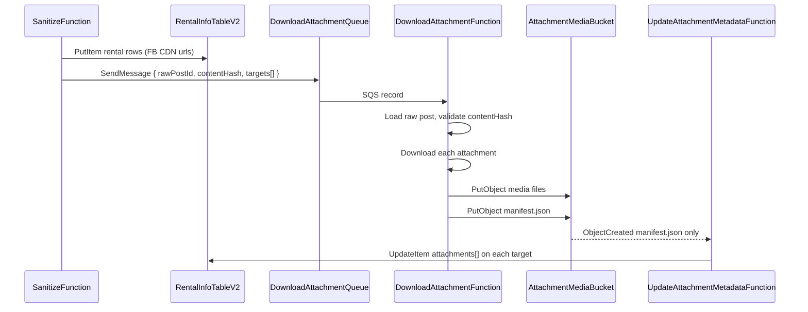

# feat: Mirror rental attachments to public S3 URLs

## Summary

Add an async attachment-mirroring stage to `apps/timtro-crawler` that runs after sanitization writes `RentalInfo` rows with Facebook CDN URLs: enqueue a mirror job, download source media into a dedicated S3 bucket, then update rental records with stable, publicly downloadable HTTPS URLs. The design keeps the user's three-step async shape (save → SQS worker → S3-triggered updater) but gates DynamoDB updates on a single manifest object so multi-photo listings never land in a mixed FB/S3 state.

---

## Problem Frame

Sanitized rental listings currently store Facebook CDN attachment URLs copied from raw crawl data. Those URLs are token-bearing, can expire, and are not under Timtro's control. MCP `search_rentals` consumers need stable, publicly fetchable media links. The original crawler plan explicitly deferred S3 mirroring to v1 follow-up (see origin); this plan implements that deferred work without changing crawl or AI sanitization behavior.

---

## Requirements

- R1. After a `RentalInfo` row is successfully saved with one or more attachments, enqueue asynchronous mirror work (do not block sanitization on download/upload).
- R2. A queue-backed worker downloads source attachment bytes and stores them in a Timtro-owned S3 bucket.
- R3. Mirrored attachment URLs in `RentalInfo.attachments[].url` must be publicly downloadable over HTTPS (no auth headers required for MCP/agents).
- R4. DynamoDB attachment updates happen only after mirroring completes for the job, not while listings still point at Facebook CDN URLs mid-job (except the brief window before the job starts).
- R5. Re-sanitize / content-hash changes must not allow stale mirror jobs to overwrite newer listing data.
- R6. Follow existing crawler conventions: SAM-managed Lambdas, SQS partial batch failures, minimal queue payloads, no token-bearing URLs in logs. (Sanitization queue keeps its DLQ; download attachment queue does not use a DLQ.)
- R7. Preserve `@timtro/rental-info` attachment shape `{ type: "photo" | "video", url: string }` for MCP compatibility — swap `url` to the public S3 URL in place.

**Origin actors:** Sanitize worker (writes listings), download attachment worker (downloads/uploads), update attachment metadata worker (patches listings), MCP search consumers (read attachments)

**Origin flows:** F1 crawl → sanitize → rental info with FB URLs; F2 (new) sanitize → download attachment queue → S3 → rental info with public URLs

**Origin acceptance examples:** AE1 listing with photos is searchable via MCP using Timtro HTTPS URLs; AE2 sanitization completes even when download attachment worker is slow or temporarily failing

---

## Scope Boundaries

- Does not change Apify crawl logic, raw post schema, or Gemini sanitization prompts.
- Does not add CloudFront or custom domain in v1 (direct public S3 object URLs are sufficient for the acceptance criteria).
- Does not migrate historical v2 rows automatically; only newly sanitized listings (or re-sanitized after deploy) get mirrored.
- Does not delete orphaned S3 objects when attachment sets change on re-sanitize (lifecycle/cleanup is follow-up).
- Does not add `attachmentStatus` or other new fields on `RentalInfo` in v1; observability lives in logs, queue depth metrics, and CloudWatch alarms.
- Does not mirror attachments for posts classified as non-rental or listings with empty `attachments`.

### Deferred to Follow-Up Work

- CloudFront distribution in front of the media bucket for caching and cleaner URLs.
- S3 lifecycle policy to expire orphaned objects after re-sanitize.
- Backfill script to mirror attachments for existing v2 rows.
- Optional `attachmentStatus` / `sourceUrl` fields on `RentalInfo` if MCP needs to distinguish mirror state or retain provenance.
- GSI on `sourcePostId` for cross-region listing discovery (not needed if job payload carries target keys).

---

## Context & Research

### Relevant Code and Patterns

- `apps/timtro-crawler/src/services/rental-sanitization.service.ts` — after successful AI sanitize, loops `rentalInfoStore.put(record)`; natural enqueue hook immediately after each put (or once per batch with aggregated targets).
- `apps/timtro-crawler/src/services/aws-clients.ts` — `DynamoRentalInfoStore` (PutItem only today), `SqsSanitizationQueue` pattern for minimal JSON messages.
- `apps/timtro-crawler/src/handlers/sanitize.handler.ts` — SQS batch handler with partial failure reporting; `DownloadAttachmentFunction` should follow this shape.
- `apps/timtro-crawler/src/domain/raw-rental-post.ts` — `extractAttachmentSummaries()` already normalizes Apify nested shapes; worker should re-read raw post attachments at execution time to avoid expired URLs in stale queue bodies.
- `libs/rental-info/src/schemas.ts` — `rentalAttachmentSchema` validates `{ type, url }`; in-place URL swap keeps MCP validation unchanged.
- `apps/timtro-crawler/template.yaml` — existing `SanitizationQueue` + DLQ, resource-scoped IAM, Globals env wiring.
- `docs/spec/data-models.md` — canonical contract for `RentalAttachment` and table keys (`region`, `id`).
- `docs/plans/2026-05-19-001-feat-timtro-crawler-service-plan.md` — explicitly deferred S3 media mirroring; this plan is the intended follow-up.

### Institutional Learnings

- No `docs/solutions/` corpus yet; reuse sanitization queue patterns (visibility timeout ≥ Lambda timeout, partial batch failures, enqueue-after-durable-write). Download attachment queue omits DLQ by design — monitor queue depth and message age instead.
- One raw post can produce 0–N `RentalInfo` records (comment-derived listings) sharing identical attachments, possibly across different `region` values — mirror job must carry explicit `(region, id)` targets, not rely on `sourcePostId` lookup (no GSI today).
- Sanitize marks raw post `completed` before mirroring; MCP may briefly serve FB URLs until mirror completes — acceptable for v1.

### External References

- [Lambda with SQS partial batch failures](https://docs.aws.amazon.com/lambda/latest/dg/with-sqs.html)
- [S3 Event Notifications](https://docs.aws.amazon.com/AmazonS3/latest/userguide/EventNotifications.html)
- [S3 public access and bucket policies](https://docs.aws.amazon.com/AmazonS3/latest/userguide/access-control-block-public-access.html)

---

## Key Technical Decisions

- **Keep the user's async three-stage shape, refine stage 3 with a manifest gate:** Per-object S3 `ObjectCreated` events firing a DynamoDB update for each photo would leave listings in a mixed FB/S3 state and create re-sanitize races. `DownloadAttachmentFunction` uploads all media objects, then writes a single `manifest.json` per job; only the manifest upload triggers `UpdateAttachmentMetadataFunction`, which performs one atomic attachment-array replace per target listing.
- **Job identity:** `(rawPostId, contentHash)` — same idempotency key family as sanitization. S3 keys include `contentHash` so retries and re-sanitizes do not collide (`public/attachments/{sourcePostId}/{contentHash}/{index}.{ext}`).
- **Target discovery via job payload, not table scan:** At sanitize time the service already knows each `(region, id)` written; include `targets: [{ region, id }]` in the download attachment message. `UpdateAttachmentMetadataFunction` patches exactly those rows.
- **Staleness guard:** Updater reads current `RentalInfo`, verifies attachments still match expected source URLs (or a stored fingerprint), and applies `ConditionExpression` on `region`+`id` existence. Optionally store `attachmentContentHash` on the rental row during sanitize for a hard guard; minimum v1 guard compares source URL set from manifest against current row before overwrite.
- **Public URL format:** `https://{bucket}.s3.{region}.amazonaws.com/{key}` via bucket policy allowing `s3:GetObject` on the `public/*` prefix for `*` principal. Mirrored media and manifests live under `public/attachments/...` so future public resources (e.g. `public/assets/...`) can be added without revising the bucket policy. Block Public Access configured to allow bucket policy only on the `public/*` prefix pattern.
- **Worker re-fetches attachments from raw post:** Queue body carries identifiers and targets; worker loads `RawRentalPostsTable` and validates `contentHash` before downloading — avoids expired Facebook CDN tokens in enqueued URL snapshots.
- **Separate queue and Lambdas:** New `DownloadAttachmentQueue` (no DLQ), `DownloadAttachmentFunction` (SQS consumer), `UpdateAttachmentMetadataFunction` (S3 manifest event). Keeps sanitization latency isolated from download work.
- **Batch size 1 on download attachment queue:** Download jobs are I/O-heavy and may include video; simplifies partial failure semantics (one listing batch per message when multiple records share attachments, one message covers all targets for that raw post + hash).

---

## Open Questions

### Resolved During Planning

- **Per-object S3 events vs single update?** Single update gated by manifest — required for R4 and multi-attachment correctness.
- **Extend `RentalAttachment` schema?** No — in-place `url` swap preserves MCP contract (R7).
- **Where to enqueue?** Inside `RentalSanitizationService` after successful puts when `attachments.length > 0` and at least one rental record was written (R1).

### Deferred to Implementation

- Exact file extension detection strategy (Content-Type from response headers vs URL path vs magic bytes).
- Maximum attachment size / skip video mirroring threshold if Lambda memory/timeout proves insufficient for large FB videos.
- Whether to dedupe download attachment messages with SQS FIFO + deduplication ID or rely on idempotent S3 keys + conditional updates only.

---

## High-Level Technical Design

> *This illustrates the intended approach and is directional guidance for review, not implementation specification. The implementing agent should treat it as context, not code to reproduce.*



**Download attachment message (directional):**

```
{
  rawPostId: string,
  contentHash: string,
  sourcePostId: string,
  targets: [{ region: string, id: string }]
}
```

**Manifest object (directional, stored at `public/attachments/{sourcePostId}/{contentHash}/manifest.json`):**

```
{
  contentHash: string,
  sourcePostId: string,
  targets: [{ region, id }],
  attachments: [{ type, sourceUrl, publicUrl, s3Key }]
}
```

---

## Implementation Units

- U1. **Download attachment domain types and validation**

**Goal:** Define typed download attachment queue message and manifest schemas with zod validation, following existing `sanitization-message.ts` patterns.

**Requirements:** R1, R6

**Dependencies:** None

**Files:**
- Create: `apps/timtro-crawler/src/domain/download-attachment-message.ts`
- Create: `apps/timtro-crawler/src/domain/attachment-manifest.ts`
- Modify: `apps/timtro-crawler/src/domain/schemas.ts` (re-export validators)
- Test: `apps/timtro-crawler/test/domain/download-attachment-message.test.ts`

**Approach:**
- Message carries `rawPostId`, `contentHash`, `sourcePostId`, `targets[]` — no attachment URLs in the body (privacy + expiry).
- Manifest schema is the contract between `DownloadAttachmentFunction` and `UpdateAttachmentMetadataFunction`.

**Patterns to follow:**
- `apps/timtro-crawler/src/domain/sanitization-message.ts`

**Test scenarios:**
- Happy path: valid message parses with one or many targets.
- Edge case: empty `targets` array fails validation.
- Error path: missing `contentHash` or malformed target keys fail validation.
- Happy path: manifest round-trips with mixed photo/video entries and public URL fields.

**Verification:**
- Validators reject oversize or malformed payloads before any AWS calls.

---

- U2. **SAM infrastructure for media bucket, download attachment queue, and Lambdas**

**Goal:** Add S3 bucket, download attachment queue (no DLQ), download worker Lambda, and S3-triggered metadata updater Lambda to the crawler stack with scoped IAM and public-read policy for mirrored objects.

**Requirements:** R2, R3, R6

**Dependencies:** None

**Files:**
- Modify: `apps/timtro-crawler/template.yaml`
- Modify: `apps/timtro-crawler/src/services/config.ts` (new env vars)
- Modify: `apps/timtro-crawler/env.example.json`
- Modify: `apps/timtro-crawler/vite.config.ts` (add handler entries + `@aws-sdk/client-s3` external)
- Modify: `apps/timtro-crawler/package.json` (add `@aws-sdk/client-s3`)
- Modify: `apps/timtro-crawler/project.json` (build targets for new handlers if needed)
- Test: `apps/timtro-crawler/test/infra/template-shape.test.ts`

**Approach:**
- `AttachmentMediaBucket` with SSE-S3, versioning optional (off for v1), lifecycle deferred.
- Bucket policy: public `GetObject` on `public/*` (objects stored under `public/attachments/...`); restrict PutObject to `DownloadAttachmentFunction` role only.
- S3 notification: `ObjectCreated` filtered to suffix `manifest.json` → `UpdateAttachmentMetadataFunction`.
- `DownloadAttachmentQueue` visibility timeout ≥ download Lambda timeout (recommend 300s Lambda, 360s visibility); `QueueName: !Sub "timtro-download-attachment-${EnvironmentName}"`; no redrive/DLQ — rely on SQS retries until message retention expires.
- Globals env: `DOWNLOAD_ATTACHMENT_QUEUE_URL`, `ATTACHMENT_MEDIA_BUCKET_NAME`.
- `DownloadAttachmentFunction`: SQS event, `ReportBatchItemFailures`, timeout 300s, memory 1024MB.
- `UpdateAttachmentMetadataFunction`: S3 event, timeout 60s; `UpdateItem` on `RentalInfoTableV2`.

**Patterns to follow:**
- `SanitizationQueue` / `SanitizeFunction` in `apps/timtro-crawler/template.yaml`
- Resource naming: `!Sub "timtro-*-${EnvironmentName}"`

**Test scenarios:**
- Test expectation: none — template string assertions only.
- Infra: template contains bucket, download attachment queue (no DLQ), both Lambdas, public policy fragment, manifest suffix filter, no wildcard IAM actions.

**Verification:**
- `pnpm nx test timtro-crawler` infra tests pass; SAM template validates.

---

- U3. **AWS client extensions: S3 store, download attachment queue, rental info patch**

**Goal:** Extend AWS abstractions with S3 upload, download attachment queue send, and conditional rental info attachment updates.

**Requirements:** R2, R4, R5, R6

**Dependencies:** U1

**Files:**
- Modify: `apps/timtro-crawler/src/services/aws-clients.ts`
- Test: `apps/timtro-crawler/test/services/aws-clients.test.ts`

**Approach:**
- Add `DownloadAttachmentQueue` interface + `SqsDownloadAttachmentQueue`.
- Add `S3MediaStore` with `putObject(key, body, contentType)` and `putManifest(key, manifest)`.
- Extend `RentalInfoStore` with `updateAttachments(region, id, attachments, options?)` using `UpdateItem` on `attachments` attribute.
- Add `GetObject`/`PutObject` IAM only on the media bucket; updater gets `UpdateItem` on v2 table.

**Patterns to follow:**
- Existing `SqsSanitizationQueue`, `DynamoRawPostStore.markCompleted` conditional updates

**Test scenarios:**
- Happy path: download attachment queue serializes message without attachment URLs in body.
- Happy path: `updateAttachments` sends correct `UpdateExpression`.
- Error path: conditional update failure surfaces as retryable error for updater.

**Verification:**
- Unit tests cover serialization and update expression shape without live AWS.

---

- U4. **Enqueue download attachment jobs from sanitization**

**Goal:** After successful rental info writes, enqueue download attachment work when attachments exist.

**Requirements:** R1, R6

**Dependencies:** U1, U3

**Files:**
- Modify: `apps/timtro-crawler/src/services/rental-sanitization.service.ts`
- Modify: `apps/timtro-crawler/src/handlers/sanitize.handler.ts` (wire queue)
- Test: `apps/timtro-crawler/test/services/rental-sanitization.service.test.ts`

**Approach:**
- Inject optional `DownloadAttachmentQueue` into `RentalSanitizationService` (no-op when fake providers / missing queue URL in local mode).
- After the `for (const record of result.records)` put loop, if any record has `attachments.length > 0`, send one download attachment message with all distinct `(region, id)` targets from that sanitize result and the raw post's `contentHash` / `sourcePostId`.
- Do not enqueue for `non_rental` or zero-attachment listings.
- Enqueue failure should log and retry via sanitization retry only if enqueue is considered critical; prefer: log error but do not fail sanitize (listings remain on FB URLs) — document as accepted degradation.

**Patterns to follow:**
- `RawPostIngestionService` enqueue-after-write ordering

**Test scenarios:**
- Happy path: sanitize with attachments enqueues one message with correct targets.
- Happy path: non-rental outcome does not enqueue.
- Edge case: zero attachments skips enqueue.
- Edge case: three comment-derived records produce one message with three targets.
- Integration: enqueue called after all puts, before `markCompleted`.

**Verification:**
- Service tests prove enqueue predicates and target aggregation without Lambda.

---

- U5. **Download attachment worker (download + S3 upload + manifest)**

**Goal:** `DownloadAttachmentFunction` SQS consumer that downloads Facebook attachments and writes media + manifest to S3.

**Requirements:** R2, R4, R5, R6

**Dependencies:** U1, U2, U3

**Files:**
- Create: `apps/timtro-crawler/src/services/download-attachment.service.ts`
- Create: `apps/timtro-crawler/src/handlers/download-attachment.handler.ts`
- Create: `apps/timtro-crawler/events/download-attachment-sqs.json`
- Test: `apps/timtro-crawler/test/services/download-attachment.service.test.ts`
- Test: `apps/timtro-crawler/test/handlers/download-attachment.handler.test.ts`

**Approach:**
- Load raw post by `rawPostId`; if missing or `contentHash` mismatch → ack skip (stale job).
- Deduplicate attachment URLs (normalize: strip query string for dedupe key, keep original URL for download attempt).
- For each attachment: HTTP GET with timeout, stream to S3 under `public/attachments/{sourcePostId}/{contentHash}/{index}.{ext}`, capture `Content-Type`.
- Build manifest with public URLs and upload last.
- Partial download failure → fail whole job (SQS retry); idempotent S3 overwrites on retry.
- Redact URLs in logs (ids and counts only).

**Execution note:** Implement core download/upload logic test-first with injected fetch and S3 store mocks.

**Patterns to follow:**
- `apps/timtro-crawler/src/handlers/sanitize.handler.ts` batch semantics

**Test scenarios:**
- Happy path: two photos downloaded, two S3 puts + manifest put.
- Edge case: stale `contentHash` skips without retry.
- Edge case: duplicate URLs in raw post deduped to one download.
- Error path: HTTP 403/timeout on any attachment fails job (retry).
- Error path: invalid message body → ack without retry (poison) or exhaust SQS retries per handler policy.
- Integration: manifest uploaded only after all media objects succeed.

**Verification:**
- Handler tests cover ack/retry classification; service tests cover dedupe and staleness.

---

- U6. **Update attachment metadata (S3 manifest → rental info patch)**

**Goal:** `UpdateAttachmentMetadataFunction` triggered by manifest upload replaces FB URLs with public S3 URLs on all target listings.

**Requirements:** R3, R4, R5, R7

**Dependencies:** U1, U3, U5

**Files:**
- Create: `apps/timtro-crawler/src/services/update-attachment-metadata.service.ts`
- Create: `apps/timtro-crawler/src/handlers/update-attachment-metadata.handler.ts`
- Create: `apps/timtro-crawler/events/update-attachment-metadata-s3.json`
- Test: `apps/timtro-crawler/test/services/update-attachment-metadata.service.test.ts`
- Test: `apps/timtro-crawler/test/handlers/update-attachment-metadata.handler.test.ts`

**Approach:**
- Parse S3 event, load manifest from bucket.
- For each target: `GetItem` rental info, verify current attachment source URLs still match manifest `sourceUrl` entries (staleness / re-sanitize guard); if mismatch, skip that target with info log.
- `UpdateItem` full `attachments` array with `{ type, url: publicUrl }`.
- Idempotent: if URLs already public S3 paths for this contentHash, no-op success.

**Patterns to follow:**
- Conditional update style from `DynamoRawPostStore.markCompleted`

**Test scenarios:**
- Happy path: manifest with two attachments updates three target listings identically.
- Edge case: one target already mirrored to same public URLs → skip update.
- Edge case: listing attachments changed (re-sanitize) → skip update (guard).
- Error path: missing manifest fields → fail with logged error.
- Error path: partial target update failure does not block other targets (best-effort per target, aggregate failure for retry if any hard errors).

**Verification:**
- Updater tests prove guard logic and in-place URL replacement shape.

---

- U7. **Documentation and data model spec**

**Goal:** Document the mirror pipeline, env vars, and attachment URL lifecycle for operators and MCP consumers.

**Requirements:** R3, R6

**Dependencies:** U2–U6

**Files:**
- Modify: `apps/timtro-crawler/README.md`
- Modify: `docs/spec/data-models.md`

**Approach:**
- README: new env vars, pipeline diagram, local testing notes (fake providers skip mirror enqueue).
- Data models: note that sanitized `attachments[].url` transitions from FB CDN to public S3 URL after async mirror; raw posts unchanged.

**Test scenarios:**
- Test expectation: none — documentation only.

**Verification:**
- Spec matches implemented message/manifest shapes and public URL format.

---

## System-Wide Impact

- **Interaction graph:** `SanitizeFunction` → `RentalInfoTableV2` + `DownloadAttachmentQueue` → `DownloadAttachmentFunction` → S3 → `UpdateAttachmentMetadataFunction` → `RentalInfoTableV2`. MCP `search_rentals` reads updated URLs via existing repository (no MCP code changes required if URLs stay valid HTTPS).
- **Error propagation:** Download failures leave listings on FB URLs; monitor `DownloadAttachmentQueue` depth and age of oldest message. Sanitization success is decoupled from download success.
- **State lifecycle risks:** Re-sanitize mid-job can produce stale manifest; guarded by source URL fingerprint check. S3 keys scoped by `contentHash` prevent overwrite collisions.
- **API surface parity:** Only `attachments[].url` values change over time; no MCP tool schema changes.
- **Integration coverage:** End-to-end mirror flow requires deployed stack or LocalStack-style integration test — unit tests cover each stage; optional manual smoke with dev stack.
- **Unchanged invariants:** Raw post ingest, sanitization idempotency gates, MCP search filters, and `@timtro/rental-info` validation rules (except URL host values).

---

## Risks & Dependencies

| Risk | Mitigation |
|------|------------|
| Facebook CDN URLs expire before worker runs | Worker re-reads raw post at execution; fail/retry quickly; visibility timeout aligned with retry |
| Large videos exceed Lambda timeout | Batch size 1, 300s timeout, 1024MB memory; defer size cap decision to implementation |
| Public S3 bucket misconfiguration | Scope public read to `public/*` prefix only; store attachments under `public/attachments/...`; template-shape tests assert policy presence |
| Stale mirror overwrites after re-sanitize | Manifest guard compares source URLs; S3 keys include `contentHash` |
| Duplicate parallel jobs | Idempotent S3 keys + conditional update; optional FIFO dedup deferred |
| Mixed URL state visible in MCP | Manifest gate ensures single atomic attachment array replace per listing |

---

## Documentation / Operational Notes

- Add CloudWatch alarm on `DownloadAttachmentQueue` depth / oldest message age (follow existing ops patterns if any).
- Document that briefly after listing creation, MCP may return FB URLs until mirror completes (typically seconds–minutes).
- After deploy, existing v2 rows are not retroactively mirrored unless re-sanitized or backfill script added later.
- Run `/ce-compound` after implementation to seed `docs/solutions/` with SQS+S3 mirror learnings.

---

## Sources & References

- **Origin document:** [docs/plans/2026-05-19-001-feat-timtro-crawler-service-plan.md](docs/plans/2026-05-19-001-feat-timtro-crawler-service-plan.md)
- Related code: `apps/timtro-crawler/src/services/rental-sanitization.service.ts`, `apps/timtro-crawler/src/services/aws-clients.ts`
- Data spec: [docs/spec/data-models.md](docs/spec/data-models.md)
- Prior alignment: [docs/plans/2026-05-24-001-feat-mcp-rental-info-alignment-plan.md](docs/plans/2026-05-24-001-feat-mcp-rental-info-alignment-plan.md)
