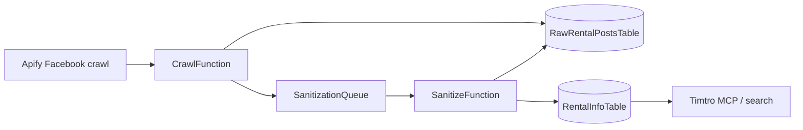

# Data models

Timtro stores rental listings in two DynamoDB tables: raw Facebook posts as crawled, and AI-sanitized rental records ready for search. This document describes those models and the table design defined in [`apps/timtro-crawler/template.yaml`](../../apps/timtro-crawler/template.yaml).

## Pipeline overview



1. **Crawl** — Apify scrapes Facebook group posts. New or changed posts are written to `timtro-raw-rental-posts-{env}` and enqueued for sanitization.
2. **Sanitize** — Gemini extracts structured rental fields from each raw post. Valid records are written to `timtro-rental-info-{env}`; the raw post is marked `completed`.
3. **Search** — Downstream services (e.g. Timtro MCP) read sanitized rental info for district/price search.

---

## DynamoDB tables

Both tables use on-demand billing, server-side encryption, and point-in-time recovery.

| Table | Name pattern | Partition key | Sort key | TTL |
|-------|--------------|---------------|----------|-----|
| Raw rental posts | `timtro-raw-rental-posts-${EnvironmentName}` | `id` (S) | — | `expiresAt` (30-day retention) |
| Rental info | `timtro-rental-info-${EnvironmentName}` | `region` (S) | `id` (S) | — |

Environment variables wired from the template:

- `RAW_RENTAL_POSTS_TABLE_NAME`
- `RENTAL_INFO_TABLE_NAME`

### RawRentalPostsTable

Single-item access by raw post id. Items expire automatically via TTL on `expiresAt` (Unix epoch seconds, set to ~30 days from ingest).

**Access patterns**

| Operation | Key | Used by |
|-----------|-----|---------|
| Get / Put / Update | `id` | CrawlFunction, SanitizeFunction |

**Conditional writes**

- `putNew`: `attribute_not_exists(id)` — first-time ingest only.
- `updateChanged`: `attribute_exists(id)` — re-ingest after content change.
- `markCompleted`: requires matching `contentHash` and `processStatus` in `pending` or `fail`.
- `markFailed`: requires matching `contentHash`.

### RentalInfoTable

Composite key supports querying all listings in a city/district **region** (`region` = `{city}_{district}`).

**Access patterns**

| Operation | Key | Used by |
|-----------|-----|---------|
| Put | `region` + `id` | SanitizeFunction |
| Query (by region) | `region` | Timtro MCP `search_rentals` |

There is no GSI today. Listing lookup by `sourcePostId` requires a query on `region` or a separate index if added later.

---

## Shared types

### RentalAttachment

Used in both raw posts and sanitized rental info.

```typescript
type RentalAttachment = {
  type: "photo" | "video";
  url: string; // HTTPS URL
};
```

Raw posts may retain long Facebook CDN query strings; sanitized records typically store cleaner CDN URLs copied from the raw attachments.

### ProcessStatus

```typescript
type ProcessStatus = "pending" | "completed" | "fail";
```

### ProcessError

Set on raw posts when AI sanitization fails.

```typescript
type ProcessError = {
  category: string;
  message: string;
  code?: string;
  provider?: string;
  retryable: boolean;
  timestamp: string; // ISO 8601
};
```

---

## Raw rental post (`RawRentalPost`)

Canonical type: [`apps/timtro-crawler/src/domain/raw-rental-post.ts`](../../apps/timtro-crawler/src/domain/raw-rental-post.ts)

Stores the crawled Facebook post, processing state, and a minimized copy of the Apify payload.

### Identity

| Field | Type | Description |
|-------|------|-------------|
| `id` | `string` | `{source}_{groupId}_{postId}` — e.g. `fb_2573980229535866_4680630662204135` |
| `source` | `"fb"` | Data source (Facebook only today) |
| `groupId` | `string` | Facebook group id (`facebookId` from Apify) |
| `postId` | `string` | Facebook legacy post id (`legacyId` from Apify) |

### Content

| Field | Type | Required | Description |
|-------|------|----------|-------------|
| `url` | `string` | | Permalink to the Facebook post |
| `postedAt` | `string` | | Original post time (ISO 8601) |
| `text` | `string` | | Post body (from `text`, `caption`, or `message`) |
| `attachments` | `RentalAttachment[]` | ✓ | Photo/video URLs extracted from Apify attachments |
| `comments` | `RawRentalComment[]` | ✓ | Top comments snapshot (may be empty) |
| `rawPayload` | `object` | ✓ | Minimized Apify fields (not full GraphQL payload) |

#### RawRentalComment

```typescript
type RawRentalComment = {
  commentId: string;
  text?: string;
  url?: string;
  timestamp?: string;
};
```

#### rawPayload shape

Minimized at ingest to reduce storage:

```typescript
{
  id?: string;           // Apify internal id
  facebookId?: string;
  legacyId?: string;
  url?: string;
  time?: string;
  text?: string;
  attachmentCount: number;
  commentCount: number;
}
```

### Processing & lifecycle

| Field | Type | Required | Description |
|-------|------|----------|-------------|
| `contentHash` | `string` | ✓ | SHA-256 of stable-serialized post content; detects edits |
| `processStatus` | `ProcessStatus` | ✓ | Sanitization state |
| `processError` | `ProcessError` | | Present when `processStatus === "fail"` |
| `sanitizedCount` | `number` | | Number of `RentalInfo` records written (0 if non-rental) |
| `crawlRunId` | `string` | | Apify run id for the crawl that ingested/updated this row |
| `createdAt` | `string` | ✓ | First ingest time (ISO 8601) |
| `updatedAt` | `string` | ✓ | Last mutation time (ISO 8601) |
| `expiresAt` | `number` | ✓ | TTL epoch seconds (~30 days from ingest) |

### Example

```json
{
  "id": "fb_2573980229535866_4680630662204135",
  "source": "fb",
  "groupId": "2573980229535866",
  "postId": "4680630662204135",
  "url": "https://www.facebook.com/groups/binhthanh.phongtro.club/permalink/4680630662204135/",
  "postedAt": "2026-05-23T05:14:53.000Z",
  "text": "5trX duplex full nội thất mới xây \n\nnằm ngay 685 xvnt,bình thanh\n\nKhông chung chủ,giờ giấc tự do\n\nliên hệ xem phòng 0945476174(Hưng)\n\nHổ trợ tìm phòng\n\n#phongtro \n\n#phongdep \n\n#FHouse \n\n#phongtrohcm",
  "attachments": [
    {
      "type": "photo",
      "url": "https://scontent-ord5-2.xx.fbcdn.net/v/t39.30808-6/703181206_122140325715124080_3791919795747285724_n.jpg?..."
    }
  ],
  "comments": [],
  "contentHash": "0b5f595ec65b54b10d3b8583cb2ba24097ecd2ad26bfe6c0a40022ffa739530e",
  "expiresAt": 1782105312,
  "processStatus": "completed",
  "sanitizedCount": 1,
  "crawlRunId": "P8XP3gg2yCEbFxqOc",
  "createdAt": "2026-05-23T05:15:12.072Z",
  "updatedAt": "2026-05-23T05:15:13.303Z",
  "rawPayload": {
    "id": "UzpfSTYxNTgzNzIyNDIxNzc5OlZLOjQ2ODA2MzA2NjIyMDQxMzU=",
    "facebookId": "2573980229535866",
    "legacyId": "4680630662204135",
    "url": "https://www.facebook.com/groups/binhthanh.phongtro.club/permalink/4680630662204135/",
    "time": "2026-05-23T05:14:53.000Z",
    "text": "5trX duplex full nội thất mới xây ...",
    "attachmentCount": 6,
    "commentCount": 0
  }
}
```

---

## Sanitized rental info (`RentalInfo`)

Canonical type: [`apps/timtro-crawler/src/domain/rental-info.ts`](../../apps/timtro-crawler/src/domain/rental-info.ts)

Structured listing produced by AI sanitization. One raw post may yield zero or more records (e.g. main post plus rental comments).

### Keys

| Field | Type | Description |
|-------|------|-------------|
| `region` | `string` | Partition key: `{city}_{district}` — e.g. `ho_chi_minh_binh_thanh` |
| `id` | `string` | Sort key: `fb_{sourcePostId}` or `fb_{sourceCommentId}` when from a comment |

### Provenance

| Field | Type | Required | Description |
|-------|------|----------|-------------|
| `source` | `"fb"` | ✓ | Always `fb` |
| `sourcePostId` | `string` | ✓ | Facebook post id (matches raw `postId`) |
| `sourceCommentId` | `string` | | Set when listing was extracted from a comment |
| `originalLink` | `string` | ✓ | Permalink to post or comment |
| `postDate` | `string` | ✓ | Listing date (ISO 8601); from post/comment time |
| `timestamp` | `string` | ✓ | Same as `postDate` after normalization |

### Location

| Field | Type | Required | Description |
|-------|------|----------|-------------|
| `address` | `string` | ✓ | Street-level address when available |
| `city` | `string` | ✓ | Normalized city key — e.g. `ho_chi_minh` |
| `cityLabel` | `string` | ✓ | Display label — e.g. `Hồ Chí Minh` |
| `district` | `string` | ✓ | Normalized district key — e.g. `binh_thanh` |
| `districtLabel` | `string` | ✓ | Display label — e.g. `Bình Thạnh` |

City and district strings from AI are resolved through [`region-mapping.ts`](../../apps/timtro-crawler/src/domain/region-mapping.ts) (aliases like `q1`, `bình thạnh`, `hcm` map to canonical keys).

### Listing content

| Field | Type | Required | Description |
|-------|------|----------|-------------|
| `title` | `string` | ✓ | Short headline |
| `description` | `string` | ✓ | Full sanitized description (may include emojis, utilities, contact) |
| `price` | `number` | ✓ | Monthly rent in VND, or `-1` if unknown |
| `priceUnit` | `"VND"` | ✓ | Always `VND` |
| `attachments` | `RentalAttachment[]` | ✓ | Photos/videos (defaults to `[]`) |

#### Price rules

- Valid price: positive integer, divisible by 1,000, between 400,000 and 80,000,000 VND.
- `price: -1` (`UNKNOWN_RENTAL_PRICE`) when rent cannot be determined.
- See [`rent-price.ts`](../../apps/timtro-crawler/src/domain/rent-price.ts) for text parsing and AI coercion.

### Example

```json
{
  "region": "ho_chi_minh_binh_thanh",
  "id": "fb_4680543562212845",
  "source": "fb",
  "sourcePostId": "4680543562212845",
  "address": "363 Đinh Bộ Lĩnh",
  "city": "ho_chi_minh",
  "cityLabel": "Hồ Chí Minh",
  "district": "binh_thanh",
  "districtLabel": "Bình Thạnh",
  "title": "Trống Sẵn Phòng Giá Rẻ - Dọn Vào Ở Ngay - Tầng 1 - Toilet riêng",
  "description": "✨ Trống Sẵn Phòng Giá Rẻ - Dọn Vào Ở Ngay \n\n🎟️ Giá chỉ 2.500.000 - Tầng 1 - Toilet riêng \n\n📍 363 Đinh Bộ Lĩnh - ngay BXMĐ \n\n⚡️ Điện 4k | Nước 100 | Dịch vụ 100 | Free 2 xe | Nhận 2 Người\n\n📲 Liên hệ xem phòng: 0931432395",
  "price": 2500000,
  "priceUnit": "VND",
  "postDate": "2026-05-23T06:15:12.000Z",
  "timestamp": "2026-05-23T06:15:12.000Z",
  "originalLink": "https://www.facebook.com/groups/binhthanh.phongtro.club/permalink/4680543562212845/",
  "attachments": [
    {
      "type": "photo",
      "url": "https://scontent-mia5-1.xx.fbcdn.net/v/t39.30808-6/704689965_122182715522922021_8301719083516857276_n.jpg"
    }
  ]
}
```

---

## ID conventions

| Entity | Pattern | Example |
|--------|---------|---------|
| Raw post | `fb_{groupId}_{postId}` | `fb_2573980229535866_4680630662204135` |
| Rental info (post) | `fb_{postId}` | `fb_4680543562212845` |
| Rental info (comment) | `fb_{commentId}` | `fb_1234567890` |
| Region | `{city}_{district}` | `ho_chi_minh_binh_thanh` |

Raw post ids include the group id because the raw table is keyed only by `id`. Rental info ids use the post/comment id alone because `region` scopes the item.

---

## Sanitization queue message

When a raw post is new or its `contentHash` changes, CrawlFunction sends an SQS message:

```typescript
type SanitizationMessage = {
  rawPostId: string;
  contentHash: string;
  crawlRunId?: string;
  source: "fb";
  groupId: string;
  postId: string;
};
```

SanitizeFunction loads the raw post by `rawPostId`, runs AI extraction, writes `RentalInfo` rows, then sets `processStatus: "completed"` and `sanitizedCount`.

---

## Raw post → rental info relationship

```mermaid
erDiagram
  RawRentalPost ||--o{ RentalInfo : "sanitizes to"
  RawRentalPost {
    string id PK
    string groupId
    string postId
    string contentHash
    string processStatus
    number sanitizedCount
  }
  RentalInfo {
    string region PK
    string id SK
    string sourcePostId
    string sourceCommentId
    number price
  }
```

- **1 → 0**: Post classified as non-rental; `sanitizedCount = 0`.
- **1 → 1**: Typical case — one listing in the post body.
- **1 → N**: Multiple listings in one post, or listings extracted from comments (`sourceCommentId` set).

Re-sanitization after a content change produces new `RentalInfo` puts with the same keys (last write wins). Raw post `contentHash` gates whether sanitization is re-triggered.

---

## DynamoDB wire format note

Items are written with `@aws-sdk/lib-dynamodb` (`DynamoDBDocumentClient`), so application code uses native JSON types (`string`, `number`, arrays, objects). Console exports may show typed attributes (`{"S": "..."}`, `{"N": "2500000"}`, `{"L": [...]}`); these map 1:1 to the schemas above.
